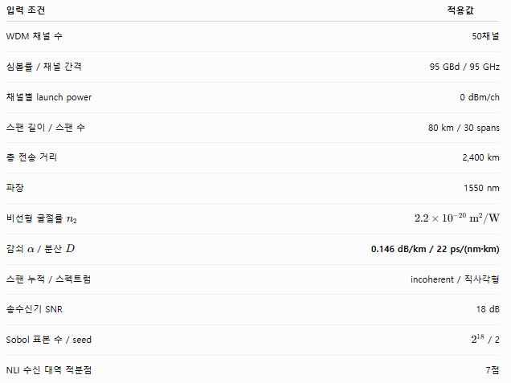

# 수치 적분 기반 GN 모델

두 Python 모듈을 함께 사용해 WDM 광전송 링크의 NLI와 ASE를 계산하고, GSNR·근사 BER·전송률·용량 및 입사전력별 성능을 평가합니다.

| 파일 | 역할 |
|---|---|
| [gn_integral_general.py](./gn_integral_general.py) | 채널·스팬 조건을 바탕으로 Sobol QMC GN 적분을 수행하고 NLI PSD와 수신 대역 내 NLI 전력을 계산합니다. |
| [gn_integral_general_modulation.py](./gn_integral_general_modulation.py) | 위 GN 엔진을 호출하여 EDFA ASE, GSNR, 변조별 근사 BER·전송률·용량과 입사전력별 GSNR을 계산합니다. |

## 주요 입력·출력

| 구분 | 항목 |
|---|---|
| 채널 입력 | 채널 수·간격, 심볼률, 채널 전력, 스펙트럼 형태 |
| 링크 입력 | 스팬 수·길이, 감쇠, 분산, 비선형 계수 gamma, 파장, EDFA 이득·NF |
| 계산 설정 | Sobol 표본 수·시드, 코히어런트/비코히어런트 누적, 수신 적분점 수 |
| 성능 입력 | 변조 방식, 부호율, 선택적 TRX SNR·Shannon gap |
| 출력 | NLI PSD·전력, ASE 전력, GSNR, 근사 BER, 총·순 전송률, 추정 용량 |

기본 GN 설정은 **Sobol 표본 2¹⁸개, 시드 1, 코히어런트 누적, 수신 적분점 7개**입니다. 채널·광섬유 조건은 사용자가 입력합니다.

## KICS Fall 2026 실험 입력 조건

아래 사진에 표시된 시스템 조건을 기준으로 GN 계산을 수행합니다. 사진의 Sobol seed 표시는 2이며, 본 실험의 seed sweep은 **seed=1, 2, 3**입니다. 각 seed의 결과를 각각 산출한 뒤 **선형 NLI 전력(W)에서 평균**합니다.

| 입력 항목 | 적용값 |
|---|---:|
| WDM 채널 수 | 50채널 |
| 심볼률 / 채널 간격 | 95 GBd / 95 GHz |
| 채널별 launch power | 0 dBm/ch |
| 스팬 길이 / 스팬 수 | 80 km / 30 spans |
| 총 전송 거리 | 2,400 km |
| 파장 | 1550 nm |
| 비선형 굴절률 n₂ | 2.2 × 10⁻²⁰ m²/W |
| 감쇠 α / 분산 D | 0.146 dB/km / 22 ps/(nm·km) |
| 스팬 누적 / 스펙트럼 | Incoherent / 직사각형 |
| 송수신기 SNR | 18 dB |
| Sobol 표본 수 | 2¹⁸ |
| Sobol seed | 1, 2, 3 (각각 계산) |
| CUT | 24 (코드의 0-based channel index) |
| NLI 수신 대역 적분점 | 7개 |

> CUT=24는 코드에서 채널 배열의 0-based 인덱스입니다. 그림의 seed=2는 공통 조건을 설명하는 예시이고, seed 평균 계산에서는 seed 1·2·3을 사용합니다. 송수신기 SNR은 GSNR 계산 조건이며 GN 적분으로 얻는 P_NLI 자체에는 직접 더해지지 않습니다.

단위는 주파수 THz, 거리 km, 전력 W(두 편광 합계), 감쇠 dB/km, 분산 ps/(nm·km), gamma 1/(W·km), NLI PSD W/THz, 전송률·용량 Gb/s입니다.

## 사용 및 적용 범위

두 파일을 같은 폴더에 두고 `pip install numpy scipy`로 필요한 패키지를 설치합니다. 주요 함수는 `integrate_nli_over_channel()`, `evaluate_performance()`, `launch_power_vs_gsnr()`입니다.

기본값 `nli_model="gn"`은 GN 모델이며, `"egn_sci"`는 SCI만 보정합니다. ASE는 집중형 EDFA용이고 수신 NLI는 직사각형 대역으로 적분합니다. BER·용량은 근사·추정값이며 상세 DSP와 PMD/PDL은 포함하지 않습니다.

검증 자료와 결과는 [GNmodel](./GNmodel/)에서 확인할 수 있습니다.
