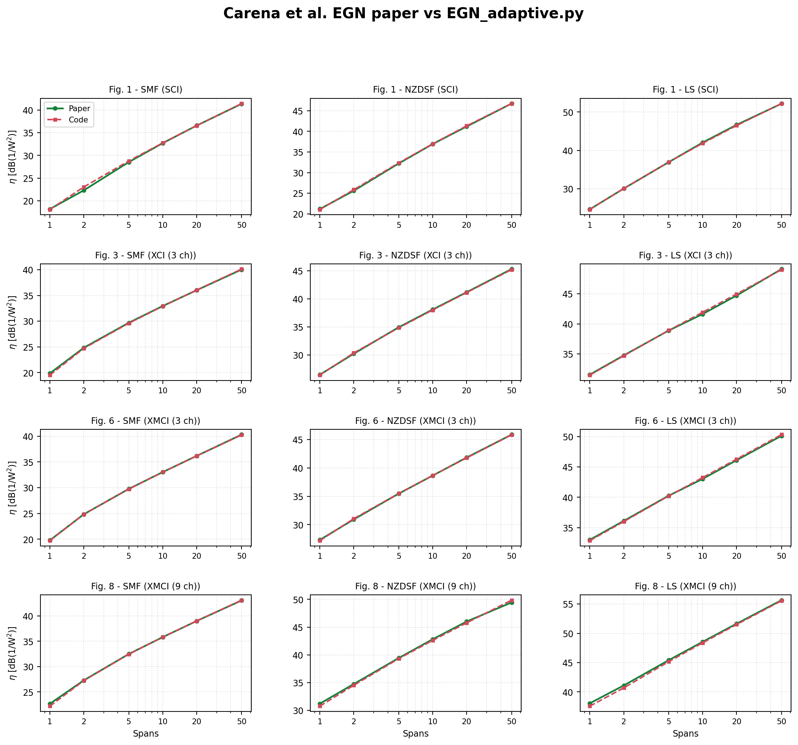

# EGN Model Validation

This folder validates [`EGN_adaptive.py`](../EGN_adaptive.py) against the green analytical EGN curves in Carena *et al.*, **“EGN model of non-linear fiber propagation,” Optics Express 22(13), 16335-16362 (2014)**.

## Result at a glance

| Item | Result |
|---|---:|
| Compared figures | Fig. 1, 3, 6, 8 |
| Compared points | 72 |
| Overall MAE | **0.136 dB** |
| Overall RMSE | **0.193 dB** |
| Mean relative error in linear eta | **3.13%** |
| Maximum absolute error | **0.745 dB** |
| Representative high-resolution repeat | <= **0.032 dB** change |
| Validation assessment | **93 / 100 - Excellent paper reproduction** |

## Validation conditions

- PM-QPSK, 32 GBd, rectangular analytical spectrum
- Channel spacing: 1.05 x symbol rate = 33.6 GHz
- Span length: 100 km; span counts: 1, 2, 5, 10, 20, 50
- Fiber types: SMF, NZDSF, LS
- Fig. 1: SCI, one channel
- Fig. 3: XCI, three channels
- Fig. 6: XMCI, three channels
- Fig. 8: XMCI, nine channels
- Paper data: digitized from the green EGN curves of the supplied 300-dpi PDF
- Error percentage: calculated in **linear eta**, not by dividing dB values

## Files

- `EGN_Model_Validation_Colab.ipynb`: executable Colab validation report
- `figures_1_3_6_8_paper_vs_code.png`: combined visual comparison
- `figure_*_paper_vs_code.png`: individual figure comparisons
- `paper_vs_code_error_summary.csv`: 12 panel-level error summary
- `paper_vs_code_detailed.csv`: all 72 comparison points

## Interpretation

The result demonstrates that the implementation reproduces the paper's SCI, XCI and MCI/XMCI accumulation trends with high fidelity. This validates the **implementation of the EGN equations**. It does not, by itself, prove that the model is more accurate than the paper or replace an independent SSFM/experimental validation.
