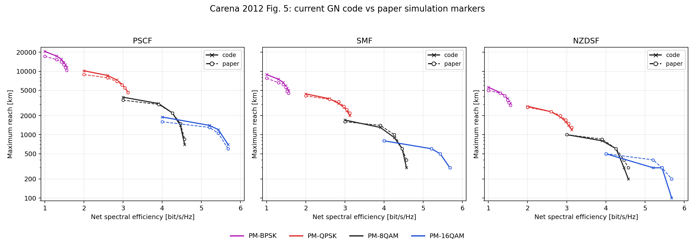

# GN 모델 검증 요약

두 논문을 기준으로 현재 [GN 적분 엔진](../gn_integral_general.py)과 [시스템 성능 모듈](../gn_integral_general_modulation.py)의 구현 신뢰성을 평가했습니다. 검증일: **2026-10-01**. 핵심 두 Python 파일은 수정하지 않았습니다.

## 결론

**선정 GN 수식의 구현 일관성과 그림 5의 전송 거리 경향을 확인했습니다.** 현재 검증 범위에서는 연구용 링크 비교·입사전력 최적화에 활용할 수 있으나, 모든 조건에서 5% 이하 정확도나 실장비 성능을 보증하는 검증은 아닙니다.

| 검증 | 결과 | 의미 |
|---|---:|---|
| Poggiolini [1]의 선정 수식 7개 | 모두 통과 | 감쇠·위상·링크 함수·스팬 누적·전력 세제곱 관계의 구현 확인 |
| 최대 수식 재현 상대오차 | 1.2945e-11% | 선정한 대수 관계의 오차; 실제 링크 예측 오차와 구분 |
| 논문 1의 QMC 시드 간 상대 표준편차 | 0.09349% | 한 표본 조건의 중앙 주파수 PSD, 32,768표본 |
| Carena [2] Fig. 5 전체 63점 MAPE | **8.71%** | 논문의 시뮬레이션 마커에서 읽은 최대 거리와 비교 |
| Fig. 5 중앙값 / 최대 상대오차 | 6.67% / 50.00% | 짧은 거리 일부에서 큰 오차 발생 |
| 참조 거리 ≥1,000 km의 MAPE | 7.45% | 해당 부분집합의 평균 상대오차 |
| 두 적분 설정 간 NLI 계수 최대 변화 | 0.180% | 복합 해상도·시드 민감도; 절대오차 상한 아님 |
| 두 설정 간 최대 거리 변화 | 0 km | 비교한 설정에서 최대 정수 스팬 수 동일 |

### 그림 5 세부 결과

| 광섬유 | 비교점 | 평균 상대오차 |
|---|---:|---:|
| PSCF | 21 | 9.75% |
| SMF | 21 | 6.95% |
| NZDSF | 21 | 9.43% |

| 변조 | 평균 상대오차 |
|---|---:|
| BPSK | 9.44% |
| QPSK | 5.27% |
| 8QAM | 10.11% |
| 16QAM | 11.03% |

## 그림 5 검증 방법과 한계

- 논문과 같이 9채널·32 GBd·100 km 스팬·NF 5 dB·BER=10⁻³·비코히어런트 NLI 누적을 사용했습니다. 광섬유 사양은 표 I, 순 심볼률은 25 GBd입니다.
- NRZ sinc² × 4차 super-Gaussian 송신 PSD를 정규화해 원본 엔진에 입력했습니다. 송신 필터 폭은 채널 간격, 수신 NLI 적분 폭은 Rs로 근사했습니다.
- 그림 3의 back-to-back OSNR을 요구 SNR로 환산하여 선형 XI/ISI 감도를 반영했습니다. 이 값은 논문에서 읽은 외부 입력이며, NLI를 그림 5에 맞추는 fitting 계수는 사용하지 않았습니다.
- 한 스팬의 NLI 계수 eta와 ASE를 계산해 Popt=(ASE₁/(2·eta))^(1/3), Nmax=floor[Popt/{SNRreq·(ASE₁+eta·Popt³)}], Lmax=100·Nmax로 최대 거리를 구했습니다.
- 최종 적분 설정은 Sobol 2¹⁸·시드 2·수신점 11개입니다. 2¹⁷·시드 1·수신점 7개의 결과와 비교했습니다. TRX 잡음 및 EGN 보정은 넣지 않았습니다.
- `paper`는 제공된 PDF 그림 5의 **시뮬레이션 마커 판독값**이며 저자의 원시 데이터가 아닙니다. 기존 참조 CSV를 PDF와 시각적으로 대조해 재사용했습니다. CSV의 4–8% 판독 불확도는 대략적 추정이며 통계적 신뢰구간은 아닙니다.
- 오차에는 판독, 송수신 스펙트럼 근사, 100 km 스팬 단위 양자화가 함께 포함됩니다. 짧은 거리에서 최대 50% 오차가 발생했습니다. 수치 수렴이 물리 정확도를 보증하지는 않습니다.
- 이 벤치마크는 변조별 논문 감도값을 사용하므로, 코드의 모든 변조 BER 근사식을 독립 검증한 결과는 아닙니다. beta3·Raman·사용자 정의 수신 필터·실험/SSFM 검증은 별도로 필요합니다.

## 실행과 결과

[실행 출력이 포함된 Colab 호환 노트북](./GN_Model_Colab.ipynb) · [Colab에서 열기](https://colab.research.google.com/github/kimheeseo/LSCNS/blob/main/2026_KICS_Fall_10/GN_model/GN_Model_Colab.ipynb)

이 저장본은 **Python/IPython에서 각 셀을 실제 실행한 노트북**입니다. Google Colab 서비스에서 실행한 기록은 아닙니다. Colab 재실행 시 검증 대상 코드는 고정 커밋에서 읽고 SHA-256을 확인합니다.

```bash
pip install -r 2026_KICS_Fall_10/GN_model/requirements.txt
python 2026_KICS_Fall_10/GN_model/execute_notebook.py
```

결과는 [result](./result/)에 저장됩니다. 원본 엔진이 변경되면 노트북 해시 검사가 중단되므로, 새 버전 평가 시 기준 해시를 의도적으로 갱신해야 합니다.



[세부 비교 CSV](./result/figure5_comparison.csv) · [수렴 비교 CSV](./result/figure5_convergence.csv) · [논문 1 실행 결과](./result/paper1_reproducibility.json) · [그림 5 실행 요약](./result/figure5_summary.json)

## 참고문헌

[1] P. Poggiolini et al., “A Detailed Analytical Derivation of the GN Model of Non-Linear Interference in Coherent Optical Transmission Systems,” arXiv:1209.0394v13, 2014. [논문](https://arxiv.org/abs/1209.0394v13).

[2] A. Carena, V. Curri, G. Bosco, P. Poggiolini, and F. Forghieri, “Modeling of the Impact of Nonlinear Propagation Effects in Uncompensated Optical Coherent Transmission Links,” JLT 30(10), 1524–1539, 2012, DOI: 10.1109/JLT.2012.2189198. [논문](https://ieeexplore.ieee.org/document/6158564/).
