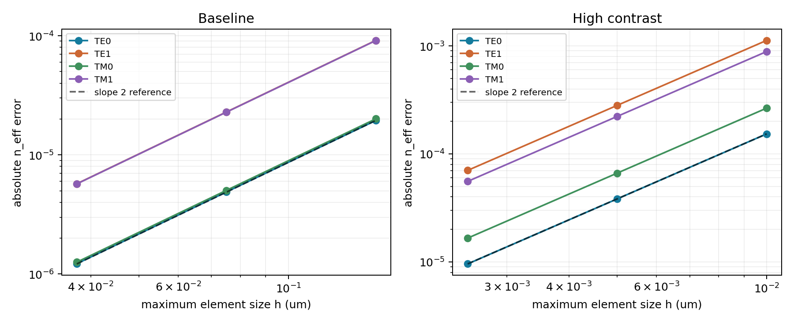
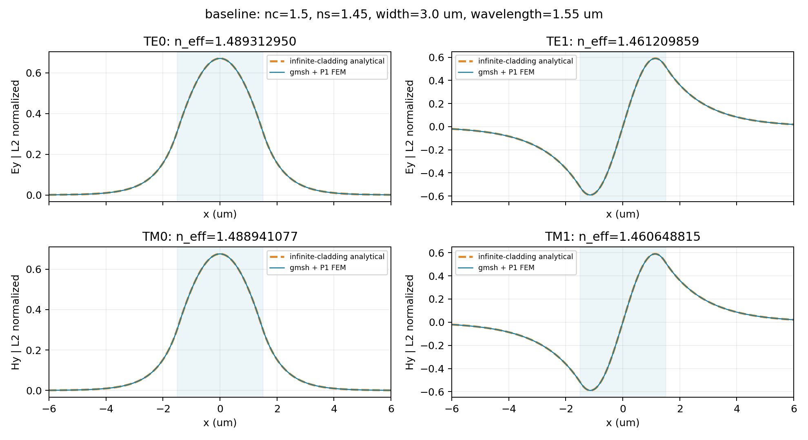
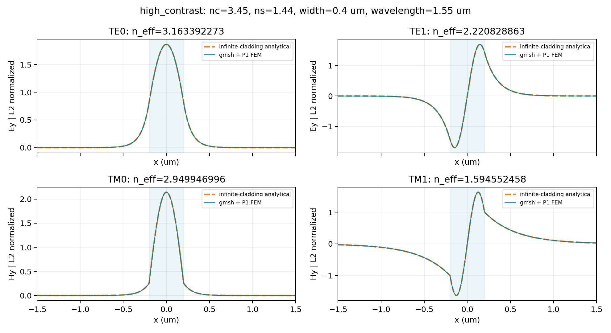

# M1 검증 보고서: 1D 슬랩 TE/TM FEM 모드 솔버

M1만 구현했습니다. 본 결과는 COMSOL과의 직접 비교 결과가 아니라 독립 해석해에 대한 검증입니다.
실행 일시와 라이브러리 버전은 `results/validation.json`에 기록했습니다.

## 1. 수식과 이산화 — 구현 전에 설명한 정의

비자성(μ_r=1), 등방성, 실수 양의 굴절률, 무손실 매질이며 y 방향으로 무한하고 z 방향으로 균일합니다.
시간/전파 관례는 exp(iβz−iωt)입니다. 모든 길이는 μm, β는 μm⁻¹를 사용합니다.
TE에서는 ψ=E_y, TM에서는 ψ=H_y를 풉니다. k₀=2π/λ₀, n_eff=β/k₀입니다.

$$
\mathrm{TE}:\quad\psi''+k_0^2 n^2(x)\psi=\beta^2\psi,
$$
$$
\mathrm{TM}:\quad\left(n^{-2}(x)\psi'\right)'+k_0^2\psi=\beta^2 n^{-2}(x)\psi.
$$

통합식 (pψ′)′+k₀²qψ=β²rψ에서 TE는 (p,q,r)=(1,n²,1), TM은 (n⁻²,1,n⁻²)입니다.
ψ,v∈H₀¹(Ω)에 대해 부분적분한 약형식은

$$
-\int_\Omega p\,\psi'\overline{v'}\,dx+k_0^2\int_\Omega q\,\psi\bar v\,dx
=\beta^2\int_\Omega r\,\psi\bar v\,dx.
$$

계면의 ψ와 pψ′는 연속입니다. TE의 ψ′ 연속과 TM의 ψ′/n² 연속을 구분합니다.
불연속 굴절률을 노드 사이에서 선형 보간하지 않고 계면 정렬 요소별 상수로 적분합니다.
무한 클래딩은 충분한 길이 L_pad를 두고 양 끝 ψ=0으로 절단합니다. 이는 정확한 개방경계나 PML이 아닙니다.

gmsh의 세 구간 transfinite 1D 메시를 scikit-fem으로 전달해 P1 연속 Lagrange FEM을 조립합니다.
요소 길이 h_e에 대해

$$
K_e=\frac{p_e}{h_e}\begin{bmatrix}1&-1\\-1&1\end{bmatrix},\quad
Q_e=\frac{q_e h_e}{6}\begin{bmatrix}2&1\\1&2\end{bmatrix},\quad
R_e=\frac{r_e h_e}{6}\begin{bmatrix}2&1\\1&2\end{bmatrix}.
$$

경계 자유도를 제거하고 (−K+k₀²Q)c=β²Rc를 풉니다. SciPy eigsh의 shift-invert 이동점은
k₀²n_c²보다 크게 설정해 가장 큰 β²부터 찾습니다. n_s<n_eff<n_c인 모드만 반환합니다.
`max_modes`는 요청 고유쌍 수이며 전체 모드 수의 보증이 아닙니다. 후보가 모두 유도 모드이면 경고합니다.
1D에서 TE/TM 분리는 Maxwell 방정식의 정확한 축약이므로 P1 스칼라 요소를 사용할 수 있습니다.
이는 M2의 2D 벡터 문제에서 nodal 벡터 요소를 써도 된다는 의미가 아닙니다.

## 2. 독립 기준과 테스트 선작성

코어 반두께 a=width/2, u=a√(k₀²n_c²−β²), w=a√(β²−k₀²n_s²), V=a k₀√(n_c²−n_s²).
여기서 V는 **반두께 기준**이며 전두께로 정의한 자료의 V와 2배 차이납니다.

$$
u^2+w^2=V^2,\quad
u\tan u=\rho w\;(\text{짝수 모드}),\quad
-u\cot u=\rho w\;(\text{홀수 모드}),
\quad \rho_{TE}=1,\ \rho_{TM}=n_c^2/n_s^2.
$$

0부터 센 모드 m에 대해 mπ/2<u<min((m+1)π/2,V)에서
u−mπ/2−atan2(ρ√(V²−u²),u)=0을 SciPy brentq로 풉니다.
이는 FEM 결과와 무관한 해석적 분산식의 수치적 근입니다. 코어 필드는 cos(ux/a) 또는 sin(ux/a),
클래딩은 계면에서 연속인 exp(−w(|x|−a)/a)입니다. 해석 필드의 무한영역 L2 정규화 적분을 닫힌식으로 계산합니다.

해석 기준 모듈은 솔버를 import하지 않으며 솔버도 해석 기준 모듈을 import하지 않습니다.
별도의 닫힌식 특수 경우 u=π/4, w=u/ρ로 해석 기준 자체를 검사했습니다.
첫 테스트 실행에서는 해석 기준 2개 통과, 솔버 모듈 부재로 26개 실패했습니다.
이후 첫 구현에서 기존 28개가 모두 통과했고, 경계 감쇠 경고를 확인할 추가 4개 테스트를 작성했습니다.
최초 두 테스트 파일의 SHA256은 구현 전후 동일합니다. 허용오차를 완화하지 않았습니다.

최초 고정 기준: 기본 슬랩 |Δn_eff|<10⁻⁵, 고대비 슬랩 <2×10⁻⁴,
필드 상대 L2 오차 <10⁻³, 상대 고유값 잔차 <10⁻⁹,
P1의 n_eff/필드 차수 1.8~2.2, 계면 편측 기울기 플럭스 차수 0.8~1.2 및 최종 오차 <3%.
기본 슬랩 padding 15→20 μm의 Δn_eff<10⁻¹⁰.
추가 고대비 영역 기준: 4→6 μm <10⁻⁸, 6→8 μm <10⁻¹⁰.
L2 오차는 각 요소의 8점 Gauss 적분으로 실제 P1 보간 필드를 해석 필드와 비교하며 부호를 맞춥니다.

## 3. 실제 실행 환경 및 결과

Python **3.11.17**; numpy 2.2.6; scipy 1.15.3; scikit-fem 12.0.2; gmsh 4.14.1; matplotlib 3.10.3; pytest 8.4.2. UTC 실행: 2026-10-10T17:17:37.375408+00:00.

**32/32 tests passed.** 초기/최종 stdout, JUnit XML 및 초기 해시는 results 폴더에 포함했습니다.
경고는 실패를 숨긴 것이 아니라 작은 클래딩의 감쇠 길이에 대한 별도 진단입니다.

### 기본 슬랩: n_c=1.50, n_s=1.45, width=3.0 μm, λ₀=1.55 μm, 양쪽 padding=20 μm

| 모드 | h_max (μm) | 요소 / 자유도 | 해석 n_eff | FEM n_eff | 절대오차 | n_eff 차수 | 필드 상대 L2 오차 | 필드 차수 |
| --- | --- | --- | --- | --- | --- | --- | --- | --- |
| TE0 | 0.1500000 | 288 / 287 | 1.489314170840 | 1.489294702430 | 1.946841e-05 | — | 1.014566e-03 | — |
| TE1 | 0.1500000 | 288 / 287 | 1.461215584893 | 1.461124133594 | 9.145130e-05 | — | 3.830931e-03 | — |
| TE0 | 0.0750000 | 574 / 573 | 1.489314170840 | 1.489309286139 | 4.884701e-06 | 1.99479 | 2.549749e-04 | 1.99244 |
| TE1 | 0.0750000 | 574 / 573 | 1.461215584893 | 1.461192686867 | 2.289803e-05 | 1.99778 | 9.575530e-04 | 2.00027 |
| TE0 | 0.0375000 | 1148 / 1147 | 1.489314170840 | 1.489312949694 | 1.221146e-06 | 2.00003 | 6.375402e-05 | 1.99977 |
| TE1 | 0.0375000 | 1148 / 1147 | 1.461215584893 | 1.461209858675 | 5.726218e-06 | 1.99957 | 2.393391e-04 | 2.00030 |
| TM0 | 0.1500000 | 288 / 287 | 1.488942336032 | 1.488922258645 | 2.007739e-05 | — | 9.991703e-04 | — |
| TM1 | 0.1500000 | 288 / 287 | 1.460654526606 | 1.460563321549 | 9.120506e-05 | — | 3.945464e-03 | — |
| TM0 | 0.0750000 | 574 / 573 | 1.488942336032 | 1.488937299400 | 5.036632e-06 | 1.99504 | 2.510378e-04 | 1.99283 |
| TM1 | 0.0750000 | 574 / 573 | 1.460654526606 | 1.460631686417 | 2.284019e-05 | 1.99754 | 9.861310e-04 | 2.00034 |
| TM0 | 0.0375000 | 1148 / 1147 | 1.488942336032 | 1.488941076913 | 1.259118e-06 | 2.00005 | 6.276811e-05 | 1.99980 |
| TM1 | 0.0375000 | 1148 / 1147 | 1.460654526606 | 1.460648814588 | 5.712018e-06 | 1.99950 | 2.464822e-04 | 2.00030 |

### 고굴절률 대비 슬랩: n_c=3.45, n_s=1.44, width=0.4 μm, λ₀=1.55 μm, 양쪽 padding=8 μm

굴절률은 벤치마크 상수이며 특정 제품의 측정값이나 파장분산 데이터는 아닙니다.

| 모드 | h_max (μm) | 요소 / 자유도 | 해석 n_eff | FEM n_eff | 절대오차 | n_eff 차수 | 필드 상대 L2 오차 | 필드 차수 |
| --- | --- | --- | --- | --- | --- | --- | --- | --- |
| TE0 | 0.0100000 | 1640 / 1639 | 3.163401847226 | 3.163248652689 | 1.531945e-04 | — | 2.723424e-04 | — |
| TE1 | 0.0100000 | 1640 / 1639 | 2.220899182223 | 2.219774012074 | 1.125170e-03 | — | 9.482530e-04 | — |
| TE0 | 0.0050000 | 3280 / 3279 | 3.163401847226 | 3.163363549016 | 3.829821e-05 | 2.00002 | 6.810200e-05 | 1.99965 |
| TE1 | 0.0050000 | 3280 / 3279 | 2.220899182223 | 2.220617902777 | 2.812794e-04 | 2.00007 | 2.370023e-04 | 2.00037 |
| TE0 | 0.0025000 | 6560 / 6559 | 3.163401847226 | 3.163392272700 | 9.574526e-06 | 2.00000 | 1.702653e-05 | 1.99991 |
| TE1 | 0.0025000 | 6560 / 6559 | 2.220899182223 | 2.220828863186 | 7.031904e-05 | 2.00002 | 5.924677e-05 | 2.00009 |
| TM0 | 0.0100000 | 1640 / 1639 | 2.949963583058 | 2.949698142491 | 2.654406e-04 | — | 2.118000e-04 | — |
| TM1 | 0.0100000 | 1640 / 1639 | 1.594608072542 | 1.593720880988 | 8.871916e-04 | — | 2.333225e-03 | — |
| TM0 | 0.0050000 | 3280 / 3279 | 2.949963583058 | 2.949897233863 | 6.634919e-05 | 2.00024 | 5.292699e-05 | 2.00063 |
| TM1 | 0.0050000 | 3280 / 3279 | 1.594608072542 | 1.594385747787 | 2.223248e-04 | 1.99658 | 5.834272e-04 | 1.99970 |
| TM0 | 0.0025000 | 6560 / 6559 | 2.949963583058 | 2.949946996443 | 1.658661e-05 | 2.00006 | 1.323031e-05 | 2.00016 |
| TM1 | 0.0025000 | 6560 / 6559 | 1.594608072542 | 1.594552458366 | 5.561418e-05 | 1.99914 | 1.458643e-04 | 1.99993 |

수렴 차수는 p=log(e_coarse/e_fine)/log(h_coarse/h_fine)입니다.
각 h는 실제 gmsh 메시의 최대 요소 길이입니다. 3단계 모두 전체 영역을 세분화했습니다.
예상 h²는 계면 정렬 및 충분한 클래딩에서의 P1 고유값·L2 필드 오차에 대한 것입니다.

TE 그림은 E_y, TM 그림은 H_y이며 ∫|ψ|²dx=1로 각각 정규화했습니다.
이 정규화는 SI 전계/자계 단위나 1 W 입력 정규화가 아닙니다. 두 편광의 곡선 높이를 전력으로 비교하면 안 됩니다.

### 계산영역 확대 — 메시 크기와 분리한 경계 절단 확인

| 조건 | 모드 | padding (μm) | n_eff | 이전 padding 대비 |Δn_eff| |
| --- | --- | --- | --- | --- |
| baseline | TE0 | 15 | 1.489311997197 | — |
| baseline | TE1 | 15 | 1.461205404578 | — |
| baseline | TE0 | 20 | 1.489311997197 | 4.440892e-16 |
| baseline | TE1 | 20 | 1.461205404583 | 4.784617e-12 |
| baseline | TE0 | 25 | 1.489311997197 | 2.220446e-16 |
| baseline | TE1 | 25 | 1.461205404583 | 2.442491e-15 |
| baseline | TM0 | 15 | 1.488940094899 | — |
| baseline | TM1 | 15 | 1.460644371715 | — |
| baseline | TM0 | 20 | 1.488940094899 | 0.000000e+00 |
| baseline | TM1 | 20 | 1.460644371723 | 8.330003e-12 |
| baseline | TM0 | 25 | 1.488940094899 | 0.000000e+00 |
| baseline | TM1 | 25 | 1.460644371723 | 6.439294e-15 |
| high_contrast | TE0 | 4 | 3.163392272700 | — |
| high_contrast | TE1 | 4 | 2.220828863186 | — |
| high_contrast | TE0 | 6 | 3.163392272700 | 1.509903e-14 |
| high_contrast | TE1 | 6 | 2.220828863186 | 9.503509e-14 |
| high_contrast | TE0 | 8 | 3.163392272700 | 2.620126e-14 |
| high_contrast | TE1 | 8 | 2.220828863186 | 2.011724e-13 |
| high_contrast | TM0 | 4 | 2.949946996443 | — |
| high_contrast | TM1 | 4 | 1.594552458264 | — |
| high_contrast | TM0 | 6 | 2.949946996443 | 1.332268e-15 |
| high_contrast | TM1 | 6 | 1.594552458366 | 1.019507e-10 |
| high_contrast | TM0 | 8 | 2.949946996443 | 4.440892e-16 |
| high_contrast | TM1 | 8 | 1.594552458366 | 1.132427e-14 |

동일 h에서 padding만 확대했습니다. 감쇠 추정 exp(−αL_pad)는 경계 절단 오차의 엄밀한 상한이 아닙니다.
특히 고대비 TM1의 padding=4 μm에서 약한 감쇠 진단이 있었지만, 영역을 확대한 변화는 위 표와 같습니다.
경계 경고는 임의 입력을 위해 남겨두었습니다.

### 계면 플럭스와 고유값 잔차

| 모드 | h_max (μm) | 상대 플럭스 불일치 | 차수 |
| --- | --- | --- | --- |
| TE0 | 0.0100000 | 4.143627e-02 | — |
| TE0 | 0.0050000 | 2.121106e-02 | 0.96608 |
| TE0 | 0.0025000 | 1.073263e-02 | 0.98281 |
| TM0 | 0.0100000 | 4.540702e-02 | — |
| TM0 | 0.0050000 | 2.328874e-02 | 0.96328 |
| TM0 | 0.0025000 | 1.179497e-02 | 0.98146 |

P1은 ψ를 강하게 연속시켜도 편측 미분값을 정확히 일치시키지는 않습니다.
위 표는 고대비 기본 모드의 pψ′ 편측 근사가 1차로 연속 플럭스에 수렴하는지 검사한 결과입니다.
기본/고대비 메시 검증에서 최대 상대 고유값 잔차: 2.239897e-12.
잔차는 조립된 행렬의 풀이 정확도를 나타내며 단독으로 물리 모델의 정확도를 보증하지 않습니다.

## 4. 검증된 범위

- 무손실·비자성·등방성 대칭 step-index 1D 슬랩의 TE0/TE1/TM0/TM1.
- 기본 슬랩 및 고굴절률 대비 슬랩에서 n_eff와 E_y/H_y 프로파일의 독립 해석해 일치.
- 각 슬랩에서 3단계 gmsh 메시의 n_eff 및 필드 L2 오차 2차 수렴.
- 고대비 기본 모드의 계면 플럭스 1차 수렴, 경계 자유도 제거, 스칼라 필드 L2 정규화.
- width=1.0 μm 기본 굴절률 슬랩의 단일 모드 수와 n_eff.
- 기본/고대비 영역 확대, 기본 TM의 gmsh/native 메시 결과 일치, 12개 잘못된 입력의 거부.

## 5. 검증되지 않은 범위

- 모든 굴절률/폭/파장 조합, 컷오프 직전의 매우 약하게 구속된 모드, TE2/TM2 이상.
- 비대칭/다층/연속 굴절률 분포, 물질분산, 복소 굴절률과 흡수·누설 손실.
- SI 전계/자계 복원, 전체 벡터 성분, 전력 정규화, 광섬유 MFD 및 2D 유효 모드 면적.
- COMSOL 출력과 직접 비교, 실제 제품 또는 측정 데이터와 비교.
- M2의 Nédélec 혼합 벡터 모드, M3의 PML/포트/S-파라미터, M4 3D.

## 6. 알려진 한계

- M1 API는 대칭 단일 코어 step-index만 받습니다. 임의 n(x) 입력을 제공한다고 주장하지 않습니다.
- Dirichlet 절단은 개방경계가 아닙니다. 새 입력에서는 메시 수렴과 영역 수렴을 각각 확인해야 합니다.
- 컷오프 근처 모드는 큰 클래딩이 필요하며 유한영역 때문에 누락될 수 있습니다.
- n_eff>n_s+10⁻¹⁰ 판정은 수치적 보호장치로, 극도로 컷오프에 가까운 모드를 제외할 수 있습니다.
- max_modes가 작으면 전체 모드를 찾지 못합니다. mode_limit_reached 진단 후 요청 수를 늘리십시오.
- 복소/이방성/자성 재료는 지원하지 않으며 복소 입력은 거부합니다. 손실값 0을 계산 결과처럼 반환하지 않습니다.
- gmsh는 시스템 공유 라이브러리가 필요합니다. 이 실행에서는 libXft를 별도로 로드했습니다.
  Linux 설치 의존성은 README에 설명했습니다. native 백엔드도 제공하지만 기본 검증은 실제 gmsh로 실행했습니다.
- gmsh는 전역 상태를 사용하므로 이 모듈은 이미 초기화된 gmsh 세션을 거부합니다. 같은 프로세스의 동시 gmsh 실행은 검증하지 않았습니다.

## 7. 다음 마일스톤

M1 통과 후 여기서 멈춥니다. M2 코드는 포함하지 않습니다. M2 착수 시에는 β 고유값에 대한
Maxwell 혼합 약형식, Nédélec/Lagrange 공간, 스퓨리어스 판별, 독립 원형 광섬유 벡터 해석해를 먼저 정해야 합니다.

## 기준 자료

- BYU ECE 360, §7.3 Dielectric Slab Waveguide, 식 (7.77), (7.78), (7.82), (7.91), (7.92):
  https://ece360web.groups.et.byu.net/notes/ln_dielectric_slab.pdf
- scikit-fem 공식 문서 — MeshLine, Basis, BilinearForm:
  https://scikit-fem.readthedocs.io/en/stable/api.html
- SciPy 공식 eigsh 문서 — 일반화 대칭 고유값 문제와 shift-invert:
  https://docs.scipy.org/doc/scipy-1.15.2/reference/generated/scipy.sparse.linalg.eigsh.html
