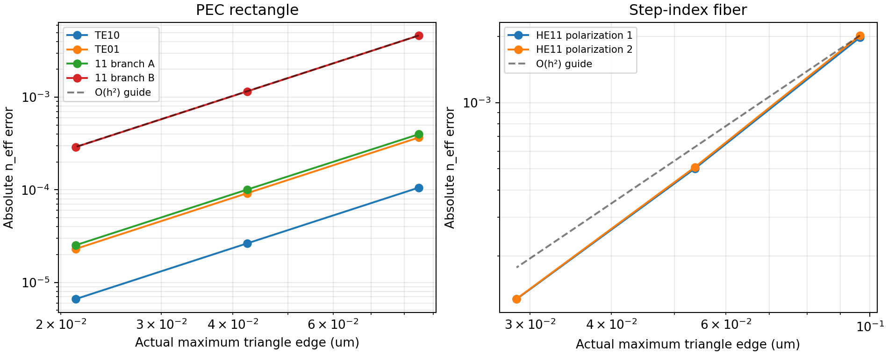
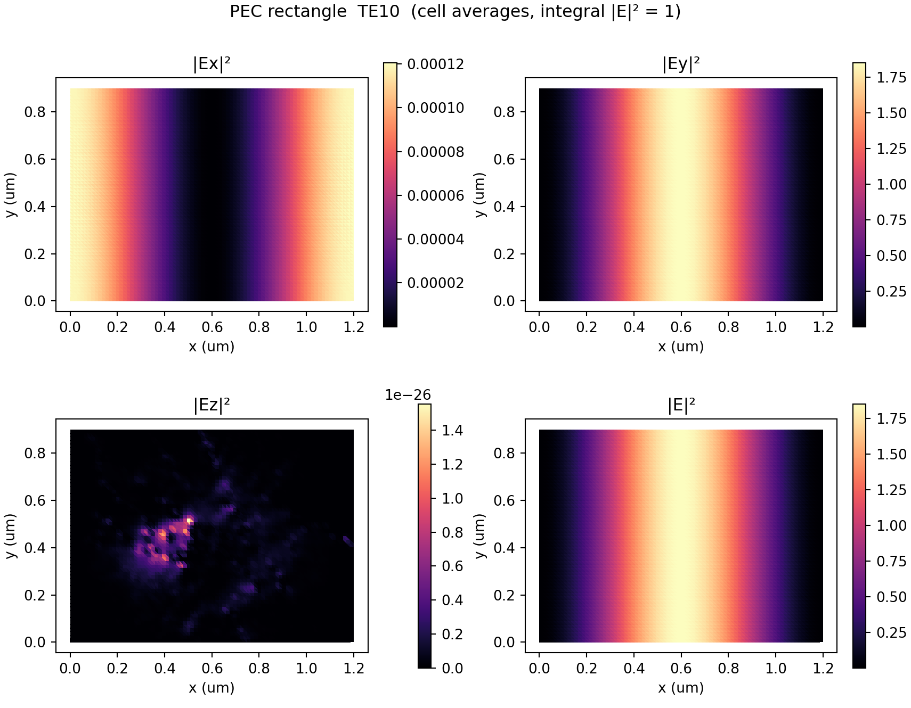
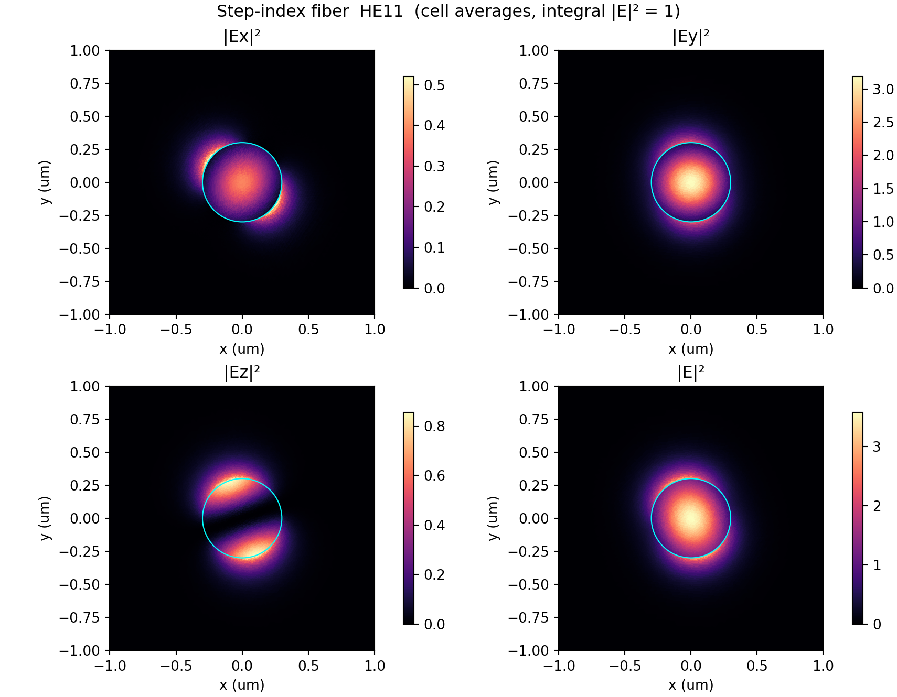

# M2 2D 전벡터 도파관 모드 해석 결과보고서

작성일: 2026년 10월 11일. 수치 검증 실행: 2026-10-10T18:08:24.072097+00:00 (UTC).

## 1 수행 결과

Nédélec–P1 Lagrange 혼합 FEM으로 2D 전벡터 모드 솔버를 구현하였다. 실제 Python
3.11.17 실행에서 **56개 테스트 통과**(M2 24개, M1 회귀 32개),
실패 0개, 실행 시간 46.529 s를 기록하였다. pytest 경고 8건은
기존 M1 경계 감쇠 진단이며 그대로 보존하였다. M2의 설정된 벤치마크 검증 기준을 충족했다.
M3는 진행하지 않았다.

임의 굴절률 입력을 스칼라/요소 배열/callable로 구현했으나 모든 임의 형상의 정확성을
보장하는 것은 아니다. 아래 검증 범위를 벗어나는 구조에는 독립 검증이 필요하다.

| 조건 | 직사각형 PEC | 원형 step-index 광섬유 |
| --- | --- | --- |
| 굴절률 | 1.5 | 코어 1.5 / 클래딩 1.0 |
| 파장 μm | 1.55 | 1.0 |
| 형상 μm | 폭 1.2 / 높이 0.9 | 코어 반경 0.3 / 외곽 반경 3.0 |
| 고유치 대상과 창 | 대상 1.4 / 창 (0.85,1.5) | 대상 1.25 / 창 (1.0001,1.4999) |
| 외곽 조건 | 물리적 PEC 벽 | 먼 외곽 PEC에 의한 영역 절단 |

| 벤치마크 | 모드 | 해석 n_eff | FEM n_eff | 절대 오차 |
| --- | --- | --- | --- | --- |
| rectangle | TE10 | 1.353846115907 | 1.353852714923 | 6.599016e-06 |
| rectangle | TE01 | 1.228205053857 | 1.228228040094 | 2.298624e-05 |
| rectangle | 11 branch A | 1.044694673039 | 1.044669460698 | 2.521234e-05 |
| rectangle | 11 branch B | 1.044694673039 | 1.044405439676 | 2.892334e-04 |
| fiber | HE11 polarization 1 | 1.188600809262 | 1.188473416697 | 1.273926e-04 |
| fiber | HE11 polarization 2 | 1.188600809262 | 1.188472962492 | 1.278468e-04 |

직사각형 11-A/B는 동일한 TE11/TM11 해석 고유치로 수렴하는 두 수치 분기이다. 표의 A/B는 독립적인 TE/TM 장 분류를 의미하지 않는다.

## 2 지배방정식과 약형식

비자성·등방성·z 방향 불변 매질, $e^{i\beta z-i\omega t}$를 사용한다.

$$\epsilon_r(x,y)=n(x,y)^2,\quad k_0=2\pi/\lambda_0,\quad
\nabla_\beta=(\partial_x,\partial_y,i\beta).$$
$$\nabla_\beta\times\nabla_\beta\times\mathbf E-k_0^2\epsilon_r\mathbf E=0,
\qquad\nabla_\beta\cdot(\epsilon_r\mathbf E)=0.$$

$\mathbf E=(\mathbf e_t,-i\beta\phi)$로 두고
$\mathbf e_t\in H_0(\mathrm{curl},\Omega)$, $\phi\in H_0^1(\Omega)$를 사용한다.
시험함수 $\mathbf v_t,\psi$에 대해

$$a=\int_\Omega (\mathrm{curl}_t\mathbf e_t)
\overline{\mathrm{curl}_t\mathbf v_t}-k_0^2\epsilon_r\mathbf e_t\cdot\overline{\mathbf v_t}\,dA,$$
$$b=\int_\Omega(\mathbf e_t+\nabla_t\phi)\cdot
(\overline{\mathbf v_t}+\nabla_t\overline\psi)
-k_0^2\epsilon_r\phi\overline\psi\,dA,\qquad a=-\beta^2b.$$

PEC 외곽은 $\mathbf e_t\cdot\mathbf t=0,\phi=0$이다. 내부 재료 경계는
접선 E 및 Ez의 연속성을 요소 공간에서 유지하고, 법선 $\epsilon_rE$의
연속성을 약형식의 Gauss 조건으로 근사한다. 유한 메시에서 법선 D의 점별 연속성을
정확히 강제한 것은 아니다. 열린 광섬유의 방사 경계가 아니라 먼 PEC 절단 경계이다.

## 3 이산화와 고유치 풀이

gmsh의 인터페이스 정합 직선 삼각형에 `ElementTriN1` 및 `ElementTriP1`을 사용한다.
이는 최저차 Nédélec 첫 번째 계열과 P1 Lagrange의 gradient 호환 쌍이다.
공통 6차 구적을 사용하고, 재료 경계는 CAD 영역 라벨로 구분한다.

$$A=\begin{bmatrix}K_{\rm curl}-k_0^2M_\epsilon&0\\0&0\end{bmatrix},\qquad
B=\begin{bmatrix}M&G\\G^T&S-k_0^2Q_\epsilon\end{bmatrix},\qquad Au=-\beta^2Bu.$$

$A$는 특이 블록을 갖고 $B$는 부정정이므로 양정정 질량행렬 고유치 풀이를 사용하지
않았다. $\sigma=-(k_0n_{\rm target})^2$에서
$(A-\sigma B)^{-1}B$를 LU 및 일반 ARPACK eigs로 계산한다.
변환 고유치 $\theta$로부터 $\lambda=\sigma+1/\theta$, $\beta=\sqrt{-\lambda}$를 복원한다.
예외적인 ARPACK 미수렴은 숨기지 않고 호출자에게 전달한다.

고유치 상대 잔차는
$\|Au-\lambda Bu\|/(\|Au\|+|\lambda|\|Bu\|)$이며,
이산 Gauss 제약은 $G_\epsilon^T e_t=\beta^2Q_\epsilon\phi$이다.
코드의 Gauss 잔차는 이 차의 2-norm을
$k_0^2\|M_\epsilon e_t\|+|\beta|^2\|Q_\epsilon\phi\|$로 나눈 값이다.
TE처럼 종방향 장이 0인 경우의 0/0 오판을 피하는 행렬 규모 정규화이다.
점별 발산 오차나 에너지 norm을 뜻하지 않는다.

Nédélec 사용만으로 모든 상황에서 스퓨리어스 모드가 사라졌다고 선언하지 않았다.
호환 gradient의 curl-free 성질, 해석적 모드 수와 중복도, 고유치/Gauss 잔차를 확인하였다.
직사각형의 지정 창에서 물리적 4개 모드, 단일 모드 광섬유에서 HE11 편광 쌍 2개가
반환되었다. 대상 주변 유한 개수만 탐색하므로 임의 창의 완전성을 보장하지 않는다.

## 4 독립 해석 기준과 출력 정의

직사각형 PEC의 TE/TM 해석식은
$$n_{\rm eff,mn}=\sqrt{n^2-(\lambda_0/2)^2[(m/a)^2+(n/b)^2]}.$$
TE는 $(m,n)\ne(0,0)$, TM은 $m,n\ge1$이다. 위 식의 하첨자 n은 모드 번호이며
굴절률 n과 구별한다. TE10은 $E_y\propto\sin(\pi x/a)$,
$A_{\rm eff}=2ab/3=0.72$ μm²이다.

광섬유는 스칼라 LP 근사가 아닌 정확한 벡터 혼성 특성방정식을 사용하였다.
$$U=a k_0\sqrt{n_c^2-n_{\rm eff}^2},\quad
W=a k_0\sqrt{n_{\rm eff}^2-n_s^2},\quad
P=J'_1(U)/(U J_1(U)),\quad Q=K'_1(W)/(W K_1(W)),$$
$$ (P+Q)(n_c^2P+n_s^2Q)=n_{\rm eff}^2(1/U^2+1/W^2)^2.$$
Brent법으로 무손실 근을 구하고, 복소 매질은 독립 특성방정식의 실수/허수 방정식에
root를 적용한다. 솔버 출력으로 해석근의 초기값이나 기준값을 만들지 않았다.
HE11의 해석 E는 Ez/Hz의 J1/K1 표현과 Maxwell 관계식으로 구성하였다.
접선 E, Ez, 법선 D 연속성도 해석장 자체에서 테스트하였다.
유효 면적 기준은 해석장의 r 및 θ 독립 적분으로 계산하였다.

$$n_{\rm eff}=\beta/k_0,\qquad
A_{\rm eff}=\frac{(\int|\mathbf E|^2dA)^2}{\int|\mathbf E|^4dA},\qquad
L_{\rm dB/m}=\frac{20}{\ln10}\mathrm{Im}(\beta_{\mu m^{-1}})10^6.$$

출력 장은 $\int|\mathbf E|^2dA=1$로 정규화한다. 1 W 또는 절대 전기장 크기가 아니다.
자기장은 $Z_0\mathbf H=\mathrm{curl}_\beta\mathbf E/(ik_0)$를 반환한다.
손실은 재료 흡수에 의한 전력 감쇠이며 이번 외곽 조건으로 방사 손실을 검증하지 않는다.

## 5 메시 수렴 결과

기울기 p=log(error_coarse/error_fine)/log(h_coarse/h_fine). 직사각형에는 실제 최대 엣지 길이를 사용한다. 광섬유에는 목표 크기 h와 실제 코어 최대 엣지 길이를 함께 제시한다. 목표 크기를 실제 크기로 오인하지 않는다.

### 직사각형 PEC

| 목표 h μm | 실제 전체 h_max μm | 실제 코어 h_max μm | 삼각형 | 자유 DOF |
| --- | --- | --- | --- | --- |
| 0.12 | 0.08485281 | - | 600 | 1131 |
| 0.06 | 0.04242641 | - | 2400 | 4661 |
| 0.03 | 0.02121320 | - | 9600 | 18921 |

| 목표 h μm | 모드 | FEM n_eff | 절대 오차 | p |
| --- | --- | --- | --- | --- |
| 0.12 | TE10 | 1.353951774113 | 1.056582e-04 | - |
| 0.12 | TE01 | 1.228572276356 | 3.672225e-04 | - |
| 0.12 | 11 branch A | 1.044296011094 | 3.986619e-04 | - |
| 0.12 | 11 branch B | 1.040050439009 | 4.644234e-03 | - |
| 0.06 | TE10 | 1.353872515672 | 2.639976e-05 | 2.000808 |
| 0.06 | TE01 | 1.228296970700 | 9.191684e-05 | 1.998253 |
| 0.06 | 11 branch A | 1.044594059809 | 1.006132e-04 | 1.986346 |
| 0.06 | 11 branch B | 1.043536918609 | 1.157754e-03 | 2.004111 |
| 0.03 | TE10 | 1.353852714923 | 6.599016e-06 | 2.000202 |
| 0.03 | TE01 | 1.228228040094 | 2.298624e-05 | 1.999559 |
| 0.03 | 11 branch A | 1.044669460698 | 2.521234e-05 | 1.996618 |
| 0.03 | 11 branch B | 1.044405439676 | 2.892334e-04 | 2.001023 |

| 목표 h μm | 첫 모드 A_eff μm² | 면적 상대 오차 | 장 상대 L2 오차 |
| --- | --- | --- | --- |
| 0.12 | 0.720986439392 | 1.370055e-03 | 4.534127e-02 |
| 0.06 | 0.720246708406 | 3.426506e-04 | 2.267203e-02 |
| 0.03 | 0.720061683059 | 8.567092e-05 | 1.133619e-02 |

### 벡터 step-index 광섬유

| 목표 h μm | 실제 전체 h_max μm | 실제 코어 h_max μm | 삼각형 | 자유 DOF |
| --- | --- | --- | --- | --- |
| 0.06 | 0.38174194 | 0.09650130 | 1518 | 2973 |
| 0.03 | 0.20067229 | 0.05380094 | 5878 | 11629 |
| 0.015 | 0.10329615 | 0.02859546 | 22880 | 45509 |

| 목표 h μm | 모드 | FEM n_eff | 절대 오차 | p |
| --- | --- | --- | --- | --- |
| 0.06 | HE11 polarization 1 | 1.186622347462 | 1.978462e-03 | - |
| 0.06 | HE11 polarization 2 | 1.186579696385 | 2.021113e-03 | - |
| 0.03 | HE11 polarization 1 | 1.188099545930 | 5.012633e-04 | 2.361225 |
| 0.03 | HE11 polarization 2 | 1.188092128300 | 5.086810e-04 | 2.361225 |
| 0.015 | HE11 polarization 1 | 1.188473416697 | 1.273926e-04 | 2.184960 |
| 0.015 | HE11 polarization 2 | 1.188472962492 | 1.278468e-04 | 2.184960 |

광섬유 p 열은 두 편광의 최대 오차와 실제 코어 h_max 기준이다. 목표 h 기준 기울기는 1.990317, 1.992345. 원 경계의 다각형 근사 오차도 포함한다.

무한 클래딩 기준 n_eff=1.188600809261684, A_eff=0.578879527256633 μm².

| 목표 h μm | 첫 모드 A_eff μm² | 면적 상대 오차 | 장 상대 L2 오차 |
| --- | --- | --- | --- |
| 0.06 | 0.586085816817 | 1.244869e-02 | 6.799319e-02 |
| 0.03 | 0.580699343479 | 3.143687e-03 | 3.385356e-02 |
| 0.015 | 0.579334610033 | 7.861442e-04 | 1.695821e-02 |

## 6 벡터 필드 분포

그림은 구적점으로 계산한 셀 평균 전기장 세기이다. 원본 엣지/P1 계수는 NPZ에 보존했다. 광섬유 HE11의 두 편광은 퇴화하므로 장 검증은 두 독립 해석 편광이 생성하는 부분공간으로 수행한다. 수치 편광 1·2의 방향은 물리적 고정 축 표기가 아니다.

## 7 복소 굴절률과 손실 검증

직사각형 n=1.5+0.001i. 광섬유 nc=1.5+0.001i, ns=1+0.0002i. 검증용 매질 수치이며 실제 실리카 재료 물성값으로 사용하지 않는다.

| 조건 | 모드 | 복소 FEM n_eff | 해석 dB/m | FEM dB/m | 손실 상대 오차 |
| --- | --- | --- | --- | --- | --- |
| rectangle_loss | TE10 | 1.353852798961 + 0.001107949107i | 39010.759522 | 39010.569374 | 4.874246e-06 |
| rectangle_loss | TE01 | 1.228228240181 + 0.001221271382i | 43001.418831 | 43000.614062 | 1.871493e-05 |
| rectangle_loss | 11 branch A | 1.044669968847 + 0.001435860171i | 50555.003498 | 50556.223602 | 2.413421e-05 |
| rectangle_loss | 11 branch B | 1.044405948452 + 0.001436223149i | 50555.003498 | 50569.003953 | 2.769351e-04 |
| fiber_loss | HE11 polarization 1 | 1.188472995312 + 0.000877974388i | 47933.518786 | 47915.499787 | 3.759165e-04 |
| fiber_loss | HE11 polarization 2 | 1.188472541108 + 0.000877971395i | 47933.518786 | 47915.336452 | 3.793240e-04 |

## 8 외곽 경계 검증

R=2,2.5,3 μm에서 h=0.02 μm를 유지하고 재메싱하였다. FEM 평균 n_eff 차이는 재메싱·외곽 효과를 함께 포함한다. 이를 순수 경계 오차라고 주장하지 않는다.

| R μm | FEM 평균 n_eff | 유한 PEC 해석 n_eff | 이전 R 대비 FEM 차이 |
| --- | --- | --- | --- |
| 2.0 | 1.188375261411 | 1.188600798636 | - |
| 2.5 | 1.188375468086 | 1.188600809140 | 2.066747e-07 |
| 3.0 | 1.188374997502 | 1.188600809260 | 4.705839e-07 |

순수 절단 경계 영향은 별도의 원형 유한 클래딩 Maxwell 해석해로 계산하였다.
클래딩 Ez에는 $K_1(\kappa r)-c_D I_1(\kappa r)$,
Hz에는 $K_1(\kappa r)-c_N I_1(\kappa r)$를 사용한다.
$c_D=K_1(\kappa R)/I_1(\kappa R)$,
$c_N=K'_1(\kappa R)/I'_1(\kappa R)$로 PEC의 Ez=0 및 접선 E=0을 만족한다.
코어/클래딩의 접선 E/H 연속성으로 구성한 2×2 행렬식의 근을 독립적으로 계산한다.
이 비교는 정확한 원형 경계의 해석적 절단 오차이며 FEM의 다각형 경계 오차는 포함하지 않는다.

| R μm | 유한 PEC 해석 n_eff | 무한 클래딩 해석근 대비 절대 오차 |
| --- | --- | --- |
| 1.0 | 1.188501955486391 | 9.885378e-05 |
| 1.5 | 1.188599839536414 | 9.697253e-07 |
| 2.0 | 1.188600798636417 | 1.062527e-08 |
| 2.5 | 1.188600809139625 | 1.220581e-10 |
| 3.0 | 1.188600809260273 | 1.410871e-12 |

## 9 실패 분석과 테스트 기록

| 단계 | 실제 결과 |
| --- | --- |
| 솔버 작성 전 | 초기 M2 2 통과 / 18 실패 — 솔버 모듈 미존재 |
| 첫 직사각형 구현 | 12 통과 / 3 실패 / 광섬유 5 제외 |
| 첫 광섬유 구현 | 5 통과 / 나머지 15 제외 |
| 직사각형 메시 수정 후 | 15 통과 / 광섬유 5 제외 |
| 추가 M2 검증 | 복소 광섬유, gradient 호환성, 출력, 유한 경계 해석 기준 |
| 최종 전체 | 56 통과 / 0 실패 / 8 경고 / 46.529 s |

첫 직사각형은 입력 h를 좌표 간격으로 처리해 실제 삼각형 지름이 h를 초과했다. 고차 11 분기의 n_eff 오차 1.157754e-3 및 첫 기본 모드 기울기 1.716234로 고정 기준을 만족하지 못했다. h를 지름 상한으로 정리하고 좌표 간격≤h/2로 더 촘촘하게 생성하여 실제 지름을 보고했다. 이는 요소 정식화 오류 수정이 아니라 메시 크기 계약 정정 및 이산화 오차 감소이다. 예전 메시에서도 고유치 잔차는 작았으므로 잔차만으로 정확도를 판단하면 안 된다. 초기 테스트 두 파일의 SHA256이 그대로임을 확인했으며 허용오차를 변경하지 않았다.

## 10 검증된 범위

비자성·등방성 직사각형 PEC의 지정 창 내 4개 전파 고유치와 중복도, TE10 전기장/자기장 관계/면적, 단일 모드 고대비 원형 step-index의 HE11 편광 쌍 고유치·벡터 전기장·면적, 두 형상의 3단계 고유치 수렴, 균질 및 step-index 복소 매질의 흡수 감쇠를 검증하였다. 이산 gradient 호환성, 고유치/Gauss 잔차, 외곽 반경 변화와 유한 경계 독립 해석근, 상수 callable/요소 배열의 일치, 보간/NPZ 출력 및 잘못된 입력의 거부를 검사하였다. M1의 32개 테스트도 회귀 통과하였다.

## 11 검증되지 않은 범위

일반 임의 형상·연속 또는 미정합 불연속 굴절률 분포의 정량 정확도, 표준 저대비 통신 광섬유 및 다중모드 광섬유, 11 분기의 개별 TE/TM 벡터장 분류, 광섬유 자기장 자체의 독립 전체장 일치, 컷오프 근처와 β=0, 이방성·이득·자성, PML과 방사/누설/굽힘 손실, 포트·S-파라미터·3D 및 COMSOL과의 직접 교차 비교는 검증하지 않았다. API가 임의 분포를 받아들이는 것과 그 모든 분포를 검증한 것은 다르다.

## 12 알려진 한계

최저차 Nédélec 장은 일반적으로 L2에서 1차 수렴한다. 실제 기본 모드 장 오차는 직사각형 약 1.13%, 광섬유 약 1.70%이며 3% 기준을 충족한다. 광섬유의 직선 요소는 원 인터페이스를 다각형으로 근사한다. 퇴화 모드는 편광 방향이 임의이며 메시가 작은 수치 분할을 만든다. 지정 대상 주변의 부분 스펙트럼만 반환하며 임의 창의 완전성을 보증하지 않는다. 외곽 PEC 모델로 방사 손실을 얻을 수 없다. 단일 프로세스 LU 및 ARPACK이므로 대규모 메시에서 메모리 비용이 커질 수 있다. gmsh는 전역 세션을 사용하므로 이미 초기화된 외부 gmsh 세션을 거부하며 별도 프로세스를 권장한다. 면적은 전기장 정의이며 다른 에너지·포인팅·Kerr 가중 면적과 동일하다고 가정하지 않는다.

## 13 실행 환경 및 산출물

| 항목 | 실제 버전 |
| --- | --- |
| Python | 3.11.17 |
| numpy | 2.2.6 |
| scipy | 1.15.3 |
| scikit-fem | 12.0.2 |
| gmsh | 4.14.1 |
| matplotlib | 3.10.3 |
| pytest | 8.4.2 |

보고서용 계산 시간 36.336 s (개별 pytest 시간과 별도). 패키지에는 solver, 테스트, 원시 JSON/CSV, NPZ 장, PNG, 초기 실패·최종 통과 로그 및 SHA256을 포함한다. 재실행 시 플랫폼·메시 생성·고유벡터 편광 방향에 따른 작은 차이는 가능하다.

## 14 참고 자료

1. FEniCS/DOLFINx 공식 혼합 모드 예제: https://docs.fenicsproject.org/dolfinx/v0.9.0/python/demos/demo_half_loaded_waveguide.html
2. Computing Optical Fiber Modes, 벡터 step-index 특성방정식: https://jayggg.github.io/fibermode/1_4_stepindex_vector.html
3. 수치 근거: results/validation_m2.json, convergence_m2.csv, pytest_final.xml. 해석 기준 코드는 tests/analytic_vector.py 및 tests/test_m2_extended.py.
