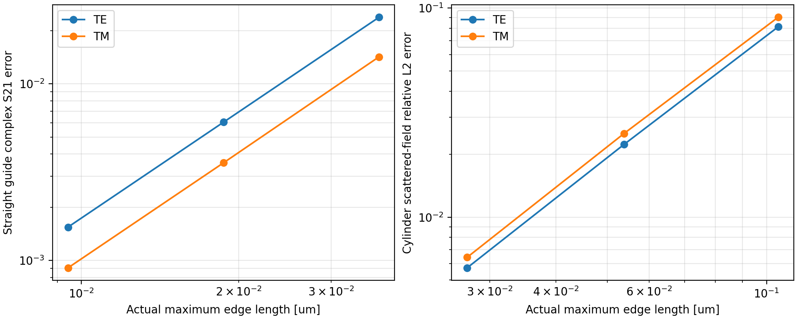
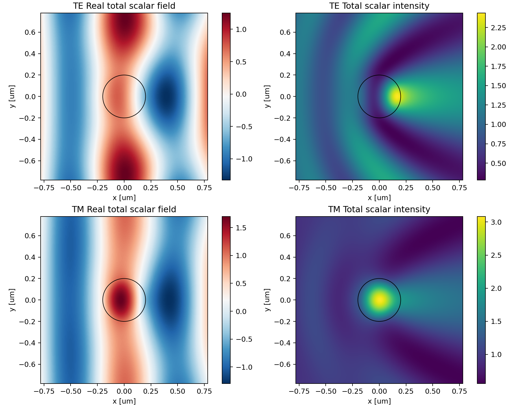
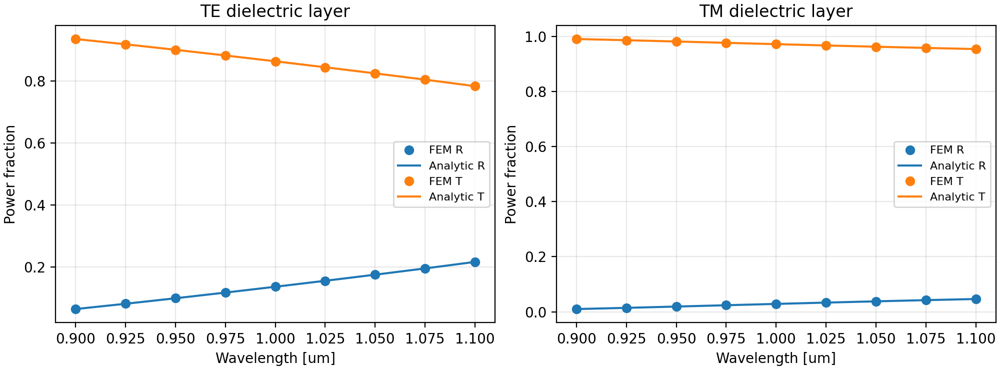

# M3 광학 산란 및 전파 해석 검증 결과보고서

실행 결과 **87개 통과, 실패 0개, 오류 0개**, pytest XML 실행시간 56.698 s. M1 32개, M2 24개, M3 31개이다. stdout은 87 passed, 22 warnings in 56.70s이다. 경고는 기존 M1의 유한 클래딩 절단 8개와 matplotlib/Pyparsing 폐기 예정 API 14개로 억제하지 않았다.

수렴 실행 UTC 2026-10-11T00:40:56.271334+00:00, 검증 스크립트 경과 25.041234 s. 수치는 실제 JSON에서 읽었다. COMSOL 대조와 M4는 수행하지 않았다.

## 1 정식화

시간 $e^{-i\omega t}$, 평면 x,y, 불변 방향 z. 여기서 TE는 해석 평면에 수직인 전기장 $u=E_z$, TM은 수직인 자기장 $u=H_z$의 2D 편광을 의미한다. 전파축 z에 대한 TEz 모드 기호와 구별한다. 비자성 등방성 매질을 사용한다.

$$\nabla\cdot(p\nabla u)+k_0^2qu=0,\quad (p,q)_{\rm TE}=(1,n^2),\quad(p,q)_{\rm TM}=(n^{-2},1).$$

재료 경계에서 u와 p∂nu가 연속이다. PEC 벽은 TE u=0, TM p∂nu=0이다. PML 외곽 산란장은 0으로 절단한다.

$$s_j=1+i\sigma_j,\quad\sigma_j=\sigma_{\max}(d_j/t_j)^r,\quad D=p\operatorname{diag}(s_y/s_x,s_x/s_y),\quad Q=qs_xs_y.$$

$$a(u,v)=\int_\Omega D\nabla u\cdot\nabla\bar v-k_0^2Qu\bar v\,dA-i\sum_\Gamma\langle Tu,v\rangle.$$

$$K\Phi-k_0^2M_q\Phi=-M_p\Phi\operatorname{diag}(\beta^2),\quad\Phi^*M_p\Phi=I,\quad T=M_p\Phi\operatorname{diag}(\beta)\Phi^*M_p.$$

$$p\partial_nu=iT(u-2u_{\rm inc}),\qquad a(u,v)=-2i\sum_\Gamma\langle Tu_{\rm inc},v\rangle.$$

선분 P1 포트의 모든 이산 모드를 유지한다. 전파 β는 양의 실수, 소멸 β는 양의 허수이다. 포트는 실수 무손실만 허용한다.

$$c=\Phi^*M_pu_\Gamma,\quad b=c-a_{\rm inc},\quad S_{mi}=b_m\sqrt{\beta_m/\beta_i}.$$

행은 출력, 열은 입사 채널이다. 기준면은 좌우 메시 외곽이고 S21에는 전파 위상이 포함된다. |S|²는 입사 전력비이며 기본 필드는 1 W가 아니다. cutoff 전력 정규화는 지원하지 않는다.

평면파는 $u_{inc}=e^{ik_b\hat d\cdot x}$, $u=u_{inc}+u_s$이며 compact contrast 부하를 사용한다. contrast가 PML에 닿으면 거부한다.

$$a_{\rm PML}(u_s,v)=-\int (p-p_b)\nabla u_{\rm inc}\cdot\nabla\bar v+k_0^2\int(q-q_b)u_{\rm inc}\bar v.$$

gmsh 정합 메시, 삼각형 P1, 6차 체적 적분, 6점 선분 Gauss 적분, 복소 희소 LU를 사용한다. 직사각형 좌표 간격은 입력 h/3 이하이고 원통은 gmsh nominal h로 생성하며 실제 hmax를 보고한다.

## 2 독립 해석 기준

직사각형 $\beta_m=\sqrt{(k_0n)^2-(m\pi/W)^2}$, $S_{11}=0$, $S_{21}=e^{i\beta L}$. 층의 state $(u,p\partial_xu)$는 다음 전달행렬을 따른다.

$$M_j=\begin{pmatrix}\cos\beta_jL_j&\sin\beta_jL_j/(p_j\beta_j)\\-p_j\beta_j\sin\beta_jL_j&\cos\beta_jL_j\end{pmatrix}.$$

원통은 반경 a에서 u와 p∂ru의 연속 조건으로 독립 급수해를 구한다. 아래 Ji,Jb,Hb는 각각 Jm(ki a), Jm(kb a), Hm^(1)(kb a)이고 prime은 argument 미분이다.

$$a_m=\frac{p_ik_iJ_i^\prime J_b-p_bk_bJ_b^\prime J_i}{p_bk_bH_b^\prime J_i-p_ik_iJ_i^\prime H_b},\quad u_s=\sum_mi^ma_mH_m^{(1)}(k_br)e^{im\theta},\quad C_{sca}=\frac4{k_b}\sum_m|a_m|^2.$$

oracle은 m=−24…24이고 FEM 산란폭 추출은 m=−8…8이다. oracle 20/24항 일치와 무대비 영 산란을 테스트했다. Csca는 [μm]의 2D 산란폭이다. FEM 해로 기준값을 만들지 않았다.

## 3 선작성 테스트와 실패 수정

최초 계약 test_scattering_m3.py와 analytic_scattering.py를 솔버 이전에 작성·실행해 oracle 2개 통과, 모듈 부재 18개 실패를 기록했다. SHA256은 results/m3_tests_before_solver.sha256이며 최종 파일과 동일하다. 초기 구현에서 TM 슬랩 S21 오차 0.0042162300859982915가 고정 기준 0.004를 넘었다. h 간격을 절반으로 줄이자 0.001056049682081433으로 감소했다. 좌표 간격 h/2를 h/3으로 세분화해 해결했으며 테스트와 허용오차를 수정하지 않았다.

13.1 GiB 임시 배열을 요구하던 점 탐색은 matplotlib 삼각형 탐색 및 P1 barycentric 보간으로 수정하고 121×121 격자 선형 함수 시험을 추가했다. NumPy 정수 JSON 오류는 Python 정수 diagnostics와 별도 시험으로 수정했다. 병행 중간 실행 일부의 exit 1 종료 원인은 확정하지 못했다. 이후 단독 수치 실행과 CLI 두 예제가 정상 완료했고 최종 전체 pytest를 통과했다. 상세 기록은 results/EXECUTION_NOTES.md이다.

## 4 세 단계 메시 수렴

관측 차수 $p_{obs}=\log(e_1/e_2)/\log(h_{max,1}/h_{max,2})$이며 nominal h=0.08,0.04,0.02 μm이다.

직선 n=1.3, W=0.7 μm, L=0.9 μm, λ=1 μm; TE m=1, TM m=0이다.

| 편광 | 입력 h μm | 실제 hmax μm | 삼각형 | 자유 DOF | 복소 S21 절대오차 | 필드 상대 L2 | 다음 단계 p |
| --- | --- | --- | --- | --- | --- | --- | --- |
| TE | 0.08 | 0.037051932 | 1836 | 910 | 2.380628291e-02 | 1.500162187e-02 | 1.998551 |
| TE | 0.04 | 0.018697923 | 7208 | 3588 | 6.068579090e-03 | 3.832108098e-03 | 1.998561 |
| TE | 0.02 | 0.009428090 | 28350 | 14144 | 1.544456094e-03 | 9.757687846e-04 | — |
| TM | 0.08 | 0.037051932 | 1836 | 980 | 1.421297960e-02 | 9.895544179e-03 | 2.018897 |
| TM | 0.04 | 0.018697923 | 7208 | 3726 | 3.573036662e-03 | 2.499368990e-03 | 2.000986 |
| TM | 0.02 | 0.009428090 | 28350 | 14416 | 9.078309903e-04 | 6.355070173e-04 | — |

원통 a=0.2 μm, n=1.5, nb=1, λ=1 μm. 물리 영역 [−0.8,0.8]² μm, 사방 PML 0.6 μm, σmax=4, r=2. 추출 원 r=0.55 μm, 필드 720점, 산란폭 1440점이다.

| 편광 | 입력 h μm | 실제 hmax μm | 삼각형 | 자유 DOF | 필드 상대 L2 | 산란폭 μm | 산란폭 상대오차 | 다음 단계 p |
| --- | --- | --- | --- | --- | --- | --- | --- | --- |
| TE | 0.08 | 0.105165270 | 3140 | 1499 | 8.131690466e-02 | 0.442771662 | 8.620944% | 1.932363 |
| TE | 0.04 | 0.053816742 | 11772 | 5747 | 2.228179401e-02 | 0.472888048 | 2.405535% | 1.992551 |
| TE | 0.02 | 0.027199398 | 45992 | 22717 | 5.720599093e-03 | 0.481469872 | 0.634421% | — |
| TM | 0.08 | 0.105165270 | 3140 | 1499 | 9.038336071e-02 | 0.190538996 | 13.861365% | 1.910517 |
| TM | 0.04 | 0.053816742 | 11772 | 5747 | 2.513125482e-02 | 0.212460850 | 3.950961% | 1.999183 |
| TM | 0.02 | 0.027199398 | 45992 | 22717 | 6.423030440e-03 | 0.218938697 | 1.022464% | — |

## 5 복소 S와 흡수 검증

유전체 층 W=0.6 μm, n=1.2/1.6/1.2, L=0.3/0.25/0.35 μm; 비대칭 n=1.2/1.6, L=0.4/0.5 μm; 흡수층 n=1.6+0.03i. 모두 λ=1 μm, nominal h=0.02 μm이다.

| 편광 | 구조 | 계수 | FEM | 해석 | 절대오차 |
| --- | --- | --- | --- | --- | --- |
| TE | layer | S11 | 0.296746724+0.221469371i | 0.296330689+0.221956054i | 6.402694455e-04 |
| TE | layer | S21 | 0.734748834−0.568363309i | 0.735749078−0.567095166i | 1.615138385e-03 |
| TE | asymmetric | S11 | 0.082174253+0.209812068i | 0.081953258+0.209930809i | 2.508756280e-04 |
| TE | asymmetric | S21 | 0.959283862+0.170296097i | 0.958904080+0.172382379i | 2.120567442e-03 |
| TE | absorbing | S11 | 0.279449825+0.217901636i | 0.279053488+0.218332062i | 5.851058886e-04 |
| TE | absorbing | S21 | 0.698343218−0.543680902i | 0.699285381−0.542451133i | 1.549193975e-03 |
| TM | layer | S11 | 0.113306327−0.125667064i | 0.113241930−0.125410851i | 2.641822461e-04 |
| TM | layer | S21 | 0.437837962+0.882987654i | 0.436992980+0.883450915i | 9.636424819e-04 |
| TM | asymmetric | S11 | 0.138522309−0.035590956i | 0.138369023−0.035527127i | 1.660444880e-04 |
| TM | asymmetric | S21 | -0.184226534+0.972422317i | -0.185459404+0.972212243i | 1.250640101e-03 |
| TM | absorbing | S11 | 0.109175967−0.120587105i | 0.109098462−0.120351177i | 2.483321384e-04 |
| TM | absorbing | S21 | 0.418590665+0.843824798i | 0.417768316+0.844243268i | 9.226996058e-04 |

| 편광 | 흡수층 FEM R+T | 흡수층 해석 R+T | FEM 흡수비 |
| --- | --- | --- | --- |
| TE | 0.908845500553 | 0.908793014263 | 9.115450% |
| TM | 0.913719246041 | 0.913663942564 | 8.628075% |

0.9–1.1 μm 9점 sweep은 nominal h=0.03 μm이며 복소 S 최대오차는 4.974000530e-03였다. 검증 굴절률은 실제 광섬유 재료 사양이 아니다.

## 6 PML과 다중 모드

도파관 물리 길이 1 μm, 우측 PML 0.5 μm, 전체 L=1.5 μm, r=2, nominal h=0.015 μm. 해석 종단 반사는 $S_{11}=-e^{2i\beta L}e^{-2\beta\sigma_{max}t/(r+1)}$이다.

| 편광 | σmax | FEM 반사 진폭 | 해석 반사 진폭 | 복소 오차 |
| --- | --- | --- | --- | --- |
| TE | 0.0 | 1.000000000e+00 | 1.000000000e+00 | 2.931902839e-03 |
| TE | 1.2 | 6.527756649e-02 | 6.522721994e-02 | 1.854379811e-04 |
| TE | 4.0 | 8.444667101e-05 | 1.117110745e-04 | 5.136094130e-05 |
| TM | 0.0 | 9.999998136e-01 | 1.000000000e+00 | 1.743594794e-03 |
| TM | 1.2 | 3.810151101e-02 | 3.811084622e-02 | 6.736001178e-05 |
| TM | 4.0 | 3.258583734e-05 | 1.862781745e-05 | 5.119292853e-05 |

강한 PML에서 종단 감쇠값과 이산화 오차가 비슷해진다. 반사가 항상 0이라고 주장하지 않는다.

| 편광 | S 크기 | 변환 반사 진폭 | 상호성 F 잔차 | 전력 보존 F 잔차 |
| --- | --- | --- | --- | --- |
| TE | 4×4 | 0.193718184 | 1.646288223e-15 | 2.645680227e-15 |
| TM | 6×6 | 0.088603899 | 5.035893660e-15 | 5.953883656e-15 |

비대칭 패치 검사의 전력 보존은 일반 형상의 독립 필드 정확도를 보장하지 않는다. 원시 S 행렬은 validation_m3.json에 있다.

## 7 적용 범위

**검증된 범위**

PEC 직사각형 TE/TM 포트, 모든 이산 소멸 모드 DtN, 직선 전파·층·비대칭 계면의 복소 S, 수동 흡수, 다중 모드 전력 보존·상호성, 유한 창 슬랩의 기본 β/S21, 원통의 정면·45도 입사 및 복소 굴절률 산란장, PML 종단 반사, 필드 복원·보간·데이터 저장이다.

**검증되지 않은 범위**

개방 횡단면 PML 모드 포트, 임의 벤드·테이퍼·격자 필드 정확도, 금속·음의 유전율, 큰 전기적 크기·강한 공진, 측정 재료 분산, M2 벡터 모드의 3D 포트 연결, COMSOL 대조이다.

**알려진 한계**

z 불변·등방성·비자성 2D scalar 분리에 한정된다. 포트는 수직·실수·무손실이고 벽은 수평이다. 인접 영역의 전파 방향 균일성을 자동 증명하지 않는다. 횡방향 PML 포트를 지원하지 않고 슬랩은 유한 PEC 창 근사이다. P1 수치 분산, 선형 원형 기하, 유한 PML 및 Hankel 차수 오차가 있다. cutoff와 3D는 지원하지 않는다. 전체 S는 채널마다 재조립하여 큰 문제 효율은 미검증이다.

## 8 재현과 출처

버전 python 3.11.17, numpy 2.2.6, scipy 1.15.3, skfem 12.0.2, gmsh 4.14.1, matplotlib 3.10.3. OpenBLAS 스레드 수 1. README의 설치·pytest·validate_m3.py·CLI 명령으로 재현한다. fields.npz는 allow_pickle=False로 읽는다.

- [DOLFINx 0.9.0 공식 PML 원통 예제](https://docs.fenicsproject.org/dolfinx/v0.9.0/python/demos/demo_pml.html)
- [oomph lib 공식 Helmholtz PML](https://oomph-lib.github.io/oomph-lib/doc/pml_helmholtz/scattering/html/index.html)
- [Orlandini et al. 포트 연구 arXiv 2407.21766](https://arxiv.org/html/2407.21766v1)

본 코드의 시간 부호에 맞추어 outgoing Hankel 1과 양의 허수 신장을 사용했다.
