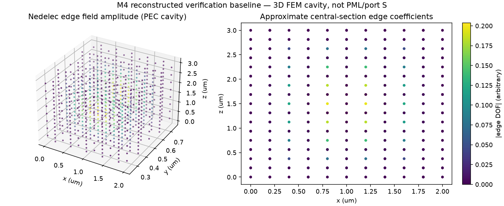
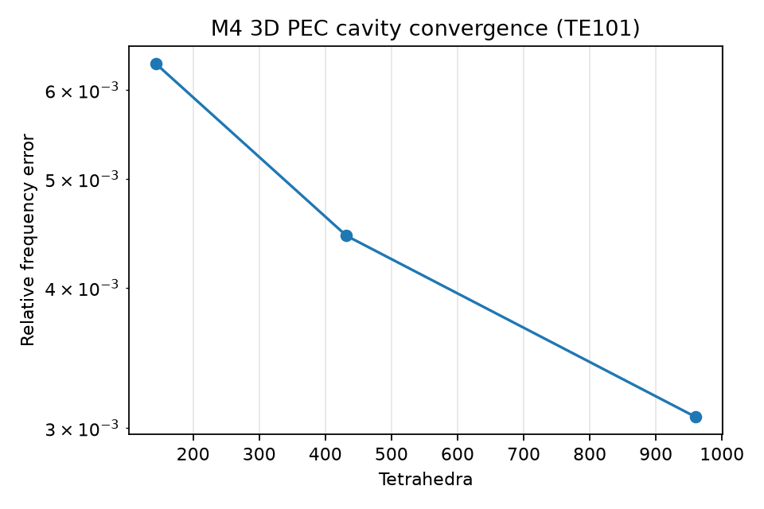

# M4 검증 보고서 — 3D Nédélec PEC cavity 수치 재구현 (제한적 복구)

**재검증 범위:** 실제 3D tetrahedral first-order Nédélec FEM, 등방성 비자성 유전체, PEC 벽, 전자기 cavity eigenmode. 기존 M4의 3D PML / mode port / complex S 행렬 전체 소스는 현재 GitHub에서 찾지 못하여 **복원·재검증했다고 주장하지 않습니다.**

## 방법
좌표 (x,y,z) 단위 μm. Maxwell 고유치 ∇×μᵣ⁻¹∇×E=k₀²εᵣE. Edge Nédélec Nᵢⱼ=λᵢ∇λⱼ−λⱼ∇λᵢ. Curl exact + tetra 4-point degree-2 mass quadrature, sparse generalized eigsh shift-invert, tangential E=0 PEC edges.

독립 직육면체 공동 TE101 기준: f=c/(2n)√[(1/Lx)²+(1/Lz)²], Lx=2, Ly=1, Lz=3 μm; 이산화에 따른 오차/잔차.

| 분할(nx,ny,nz) | tetra | DOF(자유) | FEM frequency (THz) | analytic (THz) | 상대오차 (%) | 선형 고유잔차 |
|---|---:|---:|---:|---:|---:|---:|
| [3, 2, 4] | 144 | 99 | 90.646609 | 90.076423 | 0.633 | 3.64e-15 |
| [4, 3, 6] | 432 | 355 | 90.477208 | 90.076423 | 0.445 | 1.05e-14 |
| [5, 4, 8] | 960 | 861 | 90.352840 | 90.076423 | 0.307 | 1.29e-14 |

## 추가 검증
n=1.5의 고유주파수는 n=1.0 대비 1/n 스케일법칙 **오차 0.000%**로 일치.

**통과:** 3개 메시, PEC 고유주파수 독립 기준, 고유잔차, 메시 개선 추세, n 스케일링. **미검증:** 3D mode ports, full-vector PML, S parameters, 실제 COMSOL 비교, 물리적 개방 광섬유 모드.
