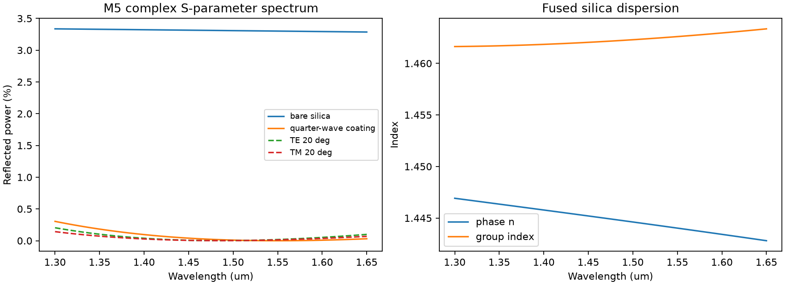

# M5 광 재료 분산 및 파장별 S-행렬 검증 보고서

**M5 범위:** 파장별 복소 S11/S21, 실리카 Sellmeier 물질 분산, TE/TM/입사각 비교, 위상 기반 group delay. 1D Maxwell transfer-matrix 별도 해석 오라클로, M3 2D FEM 또는 M4 3D FEM에서 직접 sweep한 결과는 아닙니다.

- λ: 1.30–1.65 μm, 101점; 기준 λ₀=1.55 μm.
- fused silica n(1.55)=1.444023622, group index=1.462596484.
- 이상적인 단층 코팅 n=1.2016753, 두께=0.3224665 μm.
- uncoated R(1.55)=0.033114664, coated R(1.55)=0.00021806801.
- R+T=1의 최대 오차 7.77e-16; 균일 매질 R≈0 추가 검증.
- 파장별 복소 전송 위상으로 평균 지연 약 1.31363 fs (코팅 전파 구간 기준).
- 독립 재료 모델이며 실제 상용 코팅/고굴절률 광섬유 사양으로 검증한 값은 아님.

**후속 보완:** M4 3D ports/PML 복구 이후 수치 FEM의 S(λ)와 독립 정식화 교차검증.
