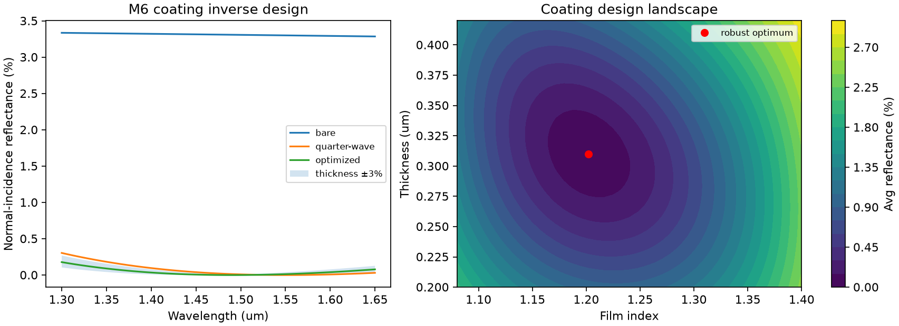

# M6 광학 단층 박막 역설계 · 제조 공차 민감도 검증 보고서

**M6 범위:** M5의 Maxwell 전송행렬을 forward model로 사용하는 경계 제약 최적화. TE/TM, 0°/20°, λ=1.30–1.65 μm 81점 및 두께 ±3% 공차를 포함한 평균 반사율 최소화.

최적화: 다중 초기점 + SciPy L-BFGS-B, n ∈ [1.05,1.42], 두께 d ∈ [0.15,0.44] μm. **실제 사용 가능한 박막 재료 또는 공정 호환성을 검증한 것이 아님**.

| 출력 항목 | 계산 |
|---|---:|
| 최적 박막 굴절률 | 1.20195582 |
| 최적 두께 (μm) | 0.30988238 |
| 무코팅 평균 R | 0.033233814 |
| 통상 quarter-wave 강건 평균 R | 0.00063152886 |
| 최적 강건 평균 R | 0.00049889508 |
| 무코팅 대비 반사율 감소 | 98.499% |
| quarter-wave 대비 감소 | 21.002% |

검증: 다중 시작점 최적화 성공, 설계 bounds 만족, 무코팅 대비 개선, 기준 quarter-wave 해 대비 개선. 재료 분산은 실리카 기판에만 반영하였고 코팅 박막은 상수 n 이상화 가정.

**후속 보완:** 다층막, 실제 박막 Sellmeier 데이터, 생산 제약(흡수, 응력, 두께 분포), 2D/3D FEM spotcheck.
