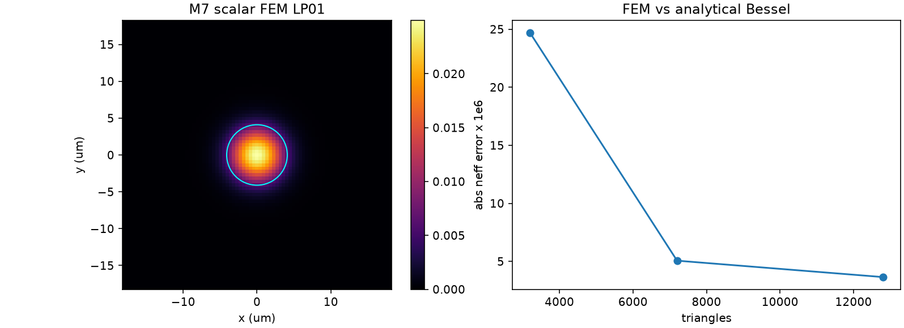
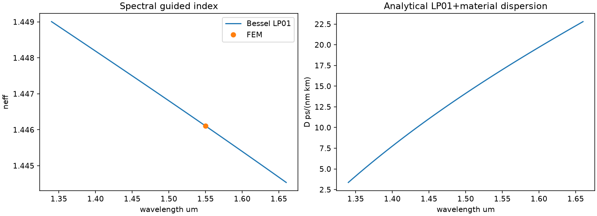

# M7 — 2D P1 FEM Step-Index Optical Fiber

Weak-guidance scalar eigenproblem: (k0^2 M_n2 - K) psi = beta^2 M psi, PEC-like Dirichlet outer boundary.
1.55um, core radius 4.1um, delta n=0.005, silica Sellmeier. Independent LP01 Bessel analytic oracle.
Aeff=(integral I)^2/integral I^2, MFD=2 sqrt(2<r^2>) by second-moment convention.
Dispersion uses derivative of ANALYTIC LP01 neff, not noisy wavelength-differenced FEM output.

Analytic LP01 neff 1.446104781, Aeff 79.291 um2, MFD 10.594 um.
Analytic dispersion at 1550nm 16.993 ps/(nm km).

| Grid | triangles | FEM neff | abs error | Aeff um2 | MFD um |
|---:|---:|---:|---:|---:|---:|
|41|3200|1.446080096|2.47e-05|80.205|10.634|
|61|7200|1.446099721|5.06e-06|79.701|10.598|
|81|12800|1.446108428|3.65e-06|79.545|10.585|

LIMITATION: weak-guidance scalar FEM, no vector Maxwell eigenmode, no PML/loss, and no actual manufacturer optical fiber comparison.
