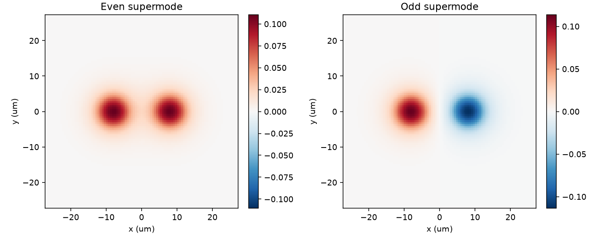
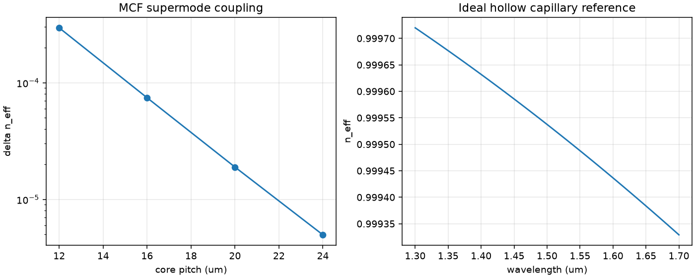

# M8 — MCF Coupled Modes and HCF Capillary Baseline

Two-core symmetric index-guiding weak-guidance scalar P1 FEM; 1.55um, radius 4.1um, delta n=0.005.
Power-transfer length Lc=lambda/[2*(neff_even-neff_odd)].

| pitch um | even neff | odd neff | delta neff | Lc mm |
|---:|---:|---:|---:|---:|
|12|1.446229947|1.445934725|0.0002952223|2.625|
|16|1.446119914|1.446045636|7.427798e-05|10.434|
|20|1.446102537|1.446083632|1.89043e-05|40.996|
|24|1.446090281|1.446085315|4.965654e-06|156.072|

## HCF analytical baseline — NOT NANF/ARF FEM
Ideal hollow capillary: neff=sqrt(n_air^2-(u01*lambda/(2*pi*R))^2), R=15um, n_air=1.00027.
At 1.55um neff=0.999487812; D=3.373 ps/(nm km).
No PML, no imaginary neff, no confinement loss, no nested tubes, no ARF antiresonance.

## MCF convergence at pitch 16um
| grid | splitting | coupling length mm |
|---:|---:|---:|
|81|7.135632e-05|10.861|
|101|7.427798e-05|10.434|
|121|7.241238e-05|10.703|
