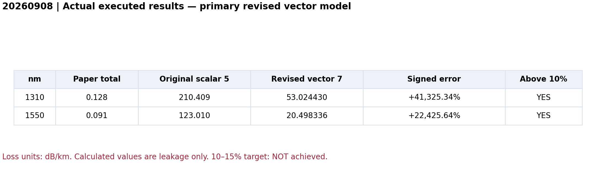
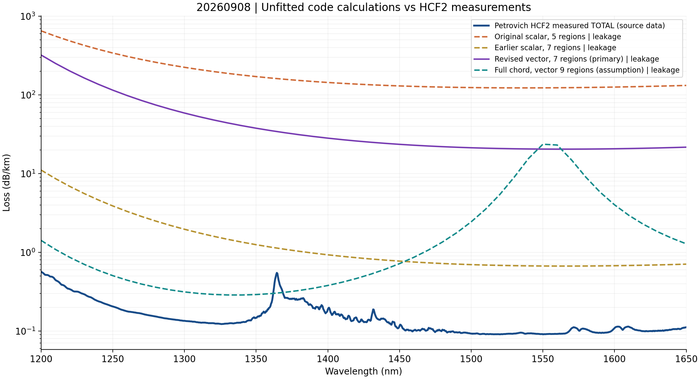
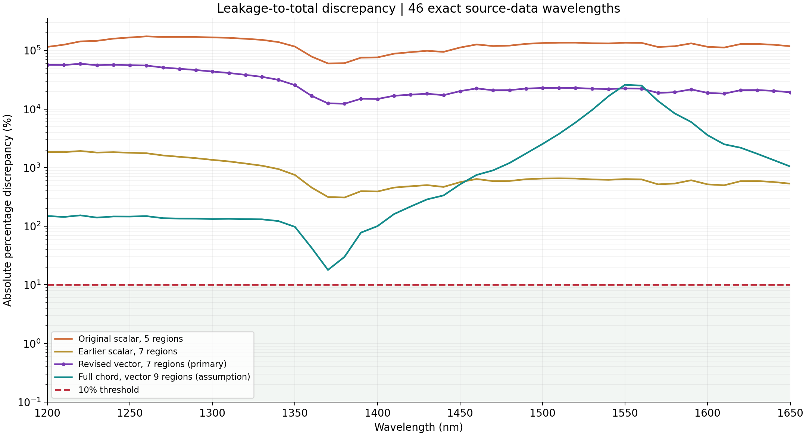
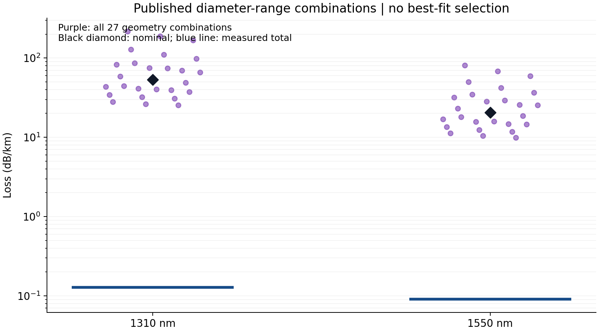

# 20260908 · HCF2 무보정 손실 코드 수정 및 실행 결과

**10–15% 목표에 도달하지 못했습니다.** 수정 주 모델의 1310/1550 nm 오차는 각각 **41,325.34% / 22,425.64%**입니다. 1200–1650 nm 원자료 평가 46점도 모두 10%를 넘습니다.

최신 실행 파일은 **[20260908.ipynb](20260908.ipynb)**입니다. **15개 코드 셀을 실제 IPython 커널에서 모두 실행**했고, 오류 출력 0개 및 PNG 출력 4개를 저장했습니다. Colab 웹에서 실행한 것은 아닙니다. 사용자가 실행 버튼을 누르지 않아도 이 페이지, HTML, 노트북에서 결과를 읽을 수 있습니다.

- [실행 출력 HTML](20260908.html) · [Colab에서 열기](https://colab.research.google.com/github/kimheeseo/LSCNS/blob/work/20260908-hcf-loss-validation/paper/20260908/20260908.ipynb)
- [1310/1550 nm 비교 CSV](20260908_nominal.csv) · [46개 파장별 오차 CSV](20260908_errors.csv)
- [입력 출처·적용식·개선 우선순위](SOURCES_AND_METHODS.md) · [모든 모델 비교 CSV](validated_results/all_models_spectral_comparison.csv)
- [실행 확인 기록](validated_results/execution_audit.json) · [환경·전체 지표 JSON](validated_results/summary.json)

## 실제 결과

계산은 **동심 구조의 누설손실**, 논문은 **실제 HCF2 총손실**입니다. 아래 백분율은 두 값의 차이를 정량화한 것이며, 검증된 총손실 예측 정확도를 의미하지 않습니다.

| 파장 (nm) | 논문 총손실 | 수정 전 scalar 5영역 | 수정 후 vector 7영역 | 부호 있는 상대오차 | 절대 백분율 오차 | 10% 초과 |
|---:|---:|---:|---:|---:|---:|:---:|
| 1310 | 0.128 | 210.408680 | 53.024430 | +41,325.34% | 41,325.34% | 예 |
| 1550 | 0.091 | 123.010202 | 20.498336 | +22,425.64% | 22,425.64% | 예 |

손실 단위: dB/km. 본문의 반올림된 두 점을 사용한 결과입니다.

| 평가 표본 | 수정 주 모델 MAPE | 최대 절대 백분율 오차 | 10% 초과 | 15% 이내 |
|---|---:|---:|---:|---:|
| 본문 1310/1550 nm, 2점 | 31,875.49% | 41,325.34% | 2/2 | 0/2 |
| 원자료 1200–1650 nm, 10 nm 간격 46점 | 29,202.47% | 59,139.12% | 46/46 | 0/46 |

원자료의 정확한 1310/1550 nm 값은 0.128206 / 0.090698975 dB/km입니다. 본문의 반올림값과 별도 집계했습니다. 그림 digitization이나 보간은 하지 않았습니다.

## 무엇을 수정했는가

기존 scalar m=0 경계조건을 **m=1 Maxwell 네 접선장 연속 조건**으로 바꿨습니다. 세 중첩막을 나타내는 기존 7영역 동심 근사가 수정 주 모델입니다. outgoing 파와 수동 감쇠 부호를 직접 검사하며 음수 손실을 절댓값으로 바꿔 통과시키지 않습니다.

원래 사용자 코드와 보존된 scalar 코드의 핵심 함수 7개는 AST 기준 동일합니다. [계보 확인](validated_results/source_lineage_audit.json). 기존 scalar 5영역 및 7영역도 이번 실행에서 다시 계산했습니다.

| 모델 | 2점 MAPE | 해석 |
|---|---:|---|
| 기존 scalar 5영역 | 149,678.91% | 수정 전 기준 |
| 이전 scalar 7영역 | 957.26% | scalar 진단; full-vector HE11 정확도로 해석할 수 없음 |
| 수정 vector 7영역 | 31,875.49% | Maxwell 경계조건을 적용한 주 결과 |
| 추가 vector 9영역 | 12,997.90% | 작은 튜브 공기와 반대쪽 접촉벽을 더한 별도 동심 형상 가정 |

vector 수정은 이전 scalar 7영역보다 실측과의 차이가 커졌습니다. 모델을 올바르게 바꾸는 것과 실측에 가까운 숫자를 얻는 것은 별개입니다. 9영역 결과가 더 가까운 파장에서도 주 모델을 바꾸지 않았으며, 어느 모델도 평가 46점에서 10–15% 목표를 달성하지 못했습니다.

## 수치 검산과 물리 모델 한계

- **Bird Table 1의 별도 동심 구조 HE11 수치 4개:** 논문 반올림값과 최대 차이 **0.0551%**, 모두 표의 ±0.0005 반올림 범위 이내. [표](validated_results/bird_table1_validation.csv)
- **별도 40자리 mpmath 구현:** 1310/1550 nm의 두 vector 모델에서 float64와 최대 차이 **0.00404%**. 주 vector 7영역만의 최대 차이는 약 0.0000116%. [표](validated_results/arbitrary_precision_checks.csv)
- 공개 지름의 27개 조합을 두 파장에서 계산한 54개 모두 수렴했습니다. 최소오차 조합을 선택하지 않았습니다. [전체 조합](validated_results/geometry_sensitivity_all_27_combinations.csv)

Bird 검산은 수치 구현을 지지하지만 실제 5-tube DNANF를 동심원으로 바꾼 모델의 정확도는 보장하지 않습니다.

## 10% 초과 시 개선 우선순위

1. **실제 5개 중첩 튜브 형상:** 현재 코드에 방위각 구속이 없습니다. 실제 SEM 단면 기반 full-vector 2D FEM/PML로 geometry와 solver를 바꾸는 것이 우선입니다. 개별 막 두께, gap, 접촉, 타원도, outer jacket, 종방향 단면이 필요합니다. 누락은 확인된 사실이고, 정확한 오차 기여 크기는 추가 계산으로 분리해야 합니다.
2. **모드·편광·공진 결합:** 실제 두 편광과 core/cladding 모드 overlap을 추적하고 mesh/PML 수렴을 검사해야 합니다. 손실이 가장 작은 고유치만 고르면 안 됩니다.
3. **총손실 항:** leakage가 이미 실측 total보다 큽니다. 양의 표면 산란·미세굽힘·가스 항을 더해서 과대예측을 해결할 수 없습니다. leakage 검증 후 독립 측정한 표면 PSD, 코팅/외경/굽힘 PSD와 가스 조건을 사용해야 합니다.
4. **기하 불확실성:** 공개 지름 범위만으로는 막 두께 분포와 종방향 변동을 재현할 수 없습니다. 실측에 맞는 치수를 역산하지 않습니다.

**현재 결과는 Petrovich FEM 또는 HCF2 실측 총손실을 대체할 수 없습니다. 다음 버전의 10% 정확도를 보장할 근거도 없습니다.**

## 비교 논문과 수정 참고 논문

- 비교: Petrovich et al., *Broadband optical fibre with an attenuation lower than 0.1 decibel per kilometre*, Nature Photonics 19, 1203–1208 (2025), [DOI](https://doi.org/10.1038/s41566-025-01747-5). HCF2 Fig. 2/3 측정값과 source data. [정정문](https://doi.org/10.1038/s41566-025-01803-0)은 Fig. 2c x축 범위 수정입니다.
- Maxwell 수정·수치 검증: Bird, *Attenuation of model hollow-core, anti-resonant fibres*, Optics Express 25, 23215–23237 (2017), [DOI](https://doi.org/10.1364/OE.25.023215). Eqs. (4)–(8), (25)와 Table 1.
- Bouncing-ray/편광 점검: Bache et al., *Poor-man’s model of hollow-core anti-resonant fibers*, JOSA B 36, 69–80 (2019), [DOI](https://doi.org/10.1364/JOSAB.36.000069). Eqs. (15)–(17). FEM fitting 계수는 사용하지 않았습니다.
- 다음 형상 개선 근거: Murphy & Bird, Optica 10, 854–870 (2023), [DOI](https://doi.org/10.1364/OPTICA.492058). 단일층 모델의 계수를 DNANF에 임의 적용하지 않습니다.

## 재실행과 이전 파일

Python 환경에서 requirements.txt를 설치한 뒤 build_20260908.py를 실행하면 됩니다. 노트북에는 코드와 원자료가 내장되어 있어 별도 저장소 파일 다운로드 없이 재실행할 수 있습니다.

실행 환경: Python 3.12.13, NumPy 2.3.5, SciPy 1.17.0, pandas 2.2.3, Matplotlib 3.10.8, mpmath 1.4.1, IPython 9.17.1.

20260908_HCF_loss_validation_executed.* 및 results/는 이전 scalar 실행 기록으로 보존했습니다. 그 기록의 “independent hold-out” 표현은 **완전한 blind 검증을 뜻하지 않습니다**. 1310/1550 nm 값은 이전부터 알려져 있었습니다. 최신 판단과 실제 셀 실행 증거는 20260908.ipynb, validated_results/ 및 이 README를 기준으로 보십시오. 과거 fitting 계수는 새 계산에 사용하지 않았습니다.
