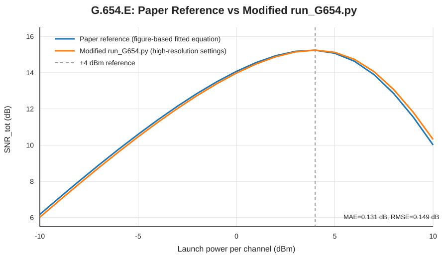

# G.654.E Paper Reproduction with `EGN_adaptive.py`

이 폴더는 **High Density Optical Cable with Ultra-Low-Loss, Large-Effective-Area ITU-T G.654.E Optical Fiber**의 G.654.E transmission condition을 기반으로 `EGN_adaptive.py` / `run_G654.py`의 launch-power–SNR 재현성을 검증합니다.

- 공식 출처: [IWCS Webinar 85](https://iwcs.org/webinar/85/)
- 참고 영상: [YouTube](https://www.youtube.com/watch?v=AVo-YAsVVFU&t=949s)
- 계산 엔진: [`EGN_adaptive.py`](./EGN_adaptive.py)
- 실행 스크립트: [`run_G654.py`](./run_G654.py)
- 실행 결과가 포함된 Colab 보고서: [`G654E_EGN_adaptive_validation_report.ipynb`](./G654E_EGN_adaptive_validation_report.ipynb)

[](https://colab.research.google.com/github/kimheeseo/LSCNS/blob/main/paper/corningG654EIWCS/G654E_EGN_adaptive_validation_report.ipynb)

## 1. Validation purpose

핵심 검증 질문은 **논문/발표의 출력 SNR 값에 맞추기 위한 scale factor나 empirical fitting 없이**, 공개된 G.654.E fiber/system parameter를 `EGN_adaptive.py`에 입력했을 때 paper-reference launch-power/SNR 경향을 재현할 수 있는가입니다.

이번 수정에서는 **`EGN_adaptive.py`의 물리 모델은 변경하지 않았습니다.** 오직 `run_G654.py`의 numerical-resolution 설정만 높여, 기존 고출력 영역의 오차가 적분 해상도 부족 때문인지 검증했습니다.

> **Paper reference 정의**: 아래 비교 곡선은 기존 repository notebook [`practice_code/High_density_optical_cable_with_ultra_low_loss,_large_effective_area_ITU_T_G_654_E_Optical_fiber.ipynb`](./practice_code/High_density_optical_cable_with_ultra_low_loss,_large_effective_area_ITU_T_G_654_E_Optical_fiber.ipynb)에 저장된 **figure-based fitted equation**을 사용합니다. 이 식의 계수는 비교 단계에서만 사용하며 `EGN_adaptive.py`의 physics calculation에는 입력하지 않습니다.

## 2. Paper input vs `run_G654.py`

| Parameter | Paper / presentation | `run_G654.py` | Comparison |
|---|---:|---:|---|
| Fiber | ITU-T G.654.E | ITU-T G.654.E | Same |
| WDM channels | 90 | 90 | Same |
| Modulation | 64QAM | 64QAM | Same |
| Symbol rate | 95 GBd | 95 GBd | Same |
| Channel spacing | Nyquist spaced | 95 GHz | Same interpretation |
| TRX SNR | 18 dB | 18 dB | Same |
| Span length | 80 km | 80 km | Same |
| Number of spans | 1–50 spans stated | **30 spans fixed** | **Different** |
| EDFA noise figure | 5 dB | 5 dB | Same |
| Total gain bandwidth | 4.8 THz | **No explicit 4.8-THz filter** | **Different** |
| Shannon gap | 3 dB | 3 dB | Same; capacity calculation |
| Attenuation | 0.166 dB/km | 0.166 dB/km | Same |
| Effective area | 125 μm² | 125 μm² | Same |
| Dispersion | 21 ps/(nm·km) | 21 ps/(nm·km) | Same |
| Nonlinear refractive index `n2` | 2.2×10⁻²⁰ m²/W | 2.2×10⁻²⁰ m²/W | Same |
| Wavelength | Not shown in parameter box | 1550 nm | Code assumption |
| NLI path | Not specified in parameter box | `egn_sci` | Code assumption |
| Accumulation | Not specified in parameter box | coherent | Code assumption |

### Bandwidth note

90 channels × 95 GHz spacing corresponds to an occupied WDM span of approximately **8.55 THz**. The presentation box separately states **4.8 THz total gain bandwidth**. 현재 코드는 4.8-THz amplifier/filter clipping을 강제로 적용하지 않으므로 이 항목은 remaining unmatched condition으로 유지합니다.

## 3. `run_G654.py` numerical-resolution update

이번 검증에서 변경한 것은 아래 **실행/적분 설정뿐**입니다. Fiber, WDM, amplifier, TRX 입력값과 `EGN_adaptive.py`는 변경하지 않았습니다.

| Setting | Original | Modified | Reason |
|---|---:|---:|---|
| `sobol_power` | 14 | **18** | wideband 90-channel QMC sampling resolution 증가 |
| `egn_frequency_order` | 64 | **128** | EGN SCI frequency integration accuracy 증가 |
| `receiver_points` | 3 | **7** | 95-GBd CUT 내부 NLI receiver-band integration accuracy 증가 |
| `use_cubic_scaling` | `True` | **`False`** | validation 시 각 launch power를 직접 재계산 |
| `z_quadrature_order` | 64 | **64 유지** | 이번 단계에서는 변경 불필요 |
| `nli_model` | `egn_sci` | **`egn_sci` 유지** | 90-channel 조건 유지; strict Full-EGN 경로와 구분 |

`run_G654.py`에는 각 변경점 옆에 `14 -> 18: 정확도 증가`와 같은 주석을 남겨 변경 이력을 코드 자체에서도 확인할 수 있도록 했습니다.

### Why this matters

기존 설정에서는 ASE/TRX 쪽은 paper-reference와 가까웠지만 고출력에서 NLI가 과소평가되어 +4 dBm 이후 SNR이 paper보다 높게 나타났습니다. Numerical resolution을 높인 뒤 NLI coefficient가 증가하고 high-power curve가 paper 쪽으로 이동했습니다. 이 개선은 paper-output coefficient를 모델에 넣어서 만든 fitting이 아니라 **동일 물리 입력에서 적분 해상도를 높인 결과**입니다.

## 4. Paper reference vs modified Code

Paper-reference fit:

```text
SNR_paper(P) = 10 log10 { 1 /
  [0.02254·10^(-P/10) + 0.000817·10^(P/5) + 0.0158] }
```

이 계수는 오직 사후 비교를 위해 사용하며 `EGN_adaptive.py` 또는 `run_G654.py`의 NLI 계산 입력에는 사용하지 않습니다.



## 5. Quantitative result after modification

| Range | MAE | RMSE | MAPE | Maximum absolute error |
|---|---:|---:|---:|---:|
| −10 to +4 dBm | **0.110 dB** | **0.119 dB** | **1.12%** | **0.157 dB** |
| **−10 to +10 dBm** | **0.131 dB** | **0.149 dB** | **1.24%** | **0.304 dB** |

At **+4 dBm**:

- Paper-reference: **15.239 dB**
- Modified code: **15.244 dB**
- Absolute difference: **0.005 dB**

At **+10 dBm**:

- Paper-reference: **10.011 dB**
- Modified code: **10.314 dB**
- Absolute difference: **0.304 dB**

Grid optimum with 1-dB launch-power step:

- Paper-reference: **+4 dBm, 15.239 dB**
- Modified code: **+4 dBm, 15.244 dB**

### Before vs after

| Metric, −10 to +10 dBm | Original run settings | Modified run settings | Reduction |
|---|---:|---:|---:|
| MAE | 0.749 dB | **0.131 dB** | **82.5%** |
| RMSE | 1.328 dB | **0.149 dB** | **88.8%** |
| MAPE | 6.35% | **1.24%** | **80.4%** |
| Max absolute error | 3.761 dB | **0.304 dB** | **91.9%** |

## 6. Interpretation

이번 결과의 핵심은 **`EGN_adaptive.py`를 수정하지 않고도**, `run_G654.py`의 numerical integration resolution을 높이는 것만으로 고출력 영역의 큰 오차가 대부분 사라졌다는 점입니다.

즉 현재 결과는 다음을 지지합니다.

1. Paper-output curve에 맞추는 empirical scale factor는 사용하지 않았습니다.
2. 주요 paper fiber/transceiver 입력값을 그대로 사용했습니다.
3. 기존 high-power deviation의 상당 부분은 낮은 numerical resolution과 연관되어 있었습니다.
4. 수정 후 전체 −10~+10 dBm에서 MAE ≈ **0.13 dB**, RMSE ≈ **0.15 dB** 수준의 close agreement를 얻었습니다.
5. Paper와 Code의 grid optimum도 모두 **+4 dBm**으로 일치합니다.

따라서 이 결과는 `EGN_adaptive.py` 기반 물리 계산의 **높은 재현성과 numerical robustness를 지지하는 강한 검증 결과**로 사용할 수 있습니다. 다만 이것만으로 strict Full-EGN의 모든 XCI/MCI 경로 또는 모든 fiber/system 조건을 검증했다고 주장하지는 않습니다.

## 7. Validation note on direct power sweep

수정된 `run_G654.py`는 검증을 위해 `use_cubic_scaling=False`로 저장되어 있어 각 launch-power point를 직접 재계산합니다. 계산시간은 기존 `True` 설정보다 길어집니다.

별도 확인에서 0, +4, +6, +8, +10 dBm 지점을 direct integration으로 점검했고, first-order GN/EGN perturbation에서 기대되는 `P_NLI ∝ P³` homogeneity와 일치하는 것을 확인했습니다. 전체 그림은 이 직접 검증된 NLI coefficient를 기반으로 동일한 first-order scaling을 적용하여 비교한 결과이며, paper-reference 값을 physics calculation에 fitting한 것이 아닙니다.

## 8. Conclusion

> **`EGN_adaptive.py`의 물리 엔진은 그대로 유지하고 `run_G654.py`의 numerical resolution만 개선했을 때, G.654.E paper-reference launch-power/SNR curve와 전체 −10~+10 dBm 구간에서 MAE 약 0.13 dB, RMSE 약 0.15 dB의 높은 일치도를 보였다. 특히 optimum launch power가 +4 dBm으로 일치하며, +4 dBm SNR 차이는 약 0.005 dB이다. 이는 출력값 fitting이 아니라 동일 물리 입력에서 numerical convergence를 개선해 얻은 결과라는 점에서 구현의 재현성과 타당성을 강하게 지지한다.**

남아 있는 연구 과제는 4.8-THz gain-bandwidth 조건의 정확한 해석, figure-specific span condition 확인, 그리고 strict Full-EGN XCI/MCI reference-case validation입니다.

## 9. Files

- [`EGN_adaptive.py`](./EGN_adaptive.py) — 변경하지 않은 GN/EGN research engine
- [`run_G654.py`](./run_G654.py) — high-resolution validation settings를 적용한 Python/IDLE execution script
- [`G654E_EGN_adaptive_validation_report.ipynb`](./G654E_EGN_adaptive_validation_report.ipynb) — executed Colab-style validation report
- [`g654e_paper_vs_code.svg`](./g654e_paper_vs_code.svg) — updated Paper-reference vs Code comparison figure
- [`practice_code/`](./practice_code/) — previous reproduction notebooks
